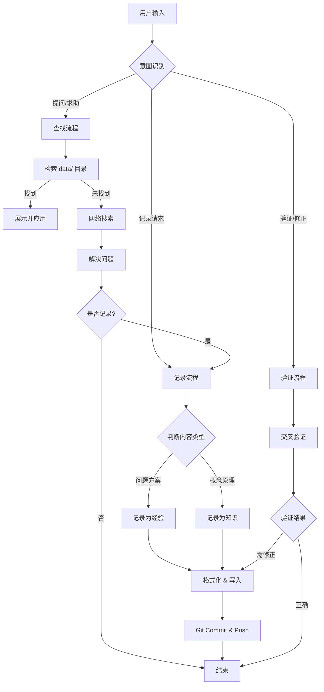
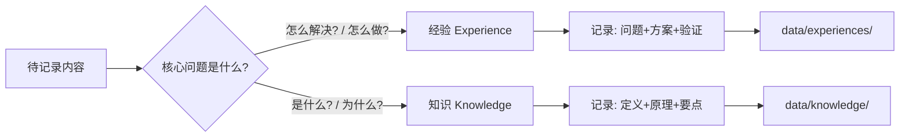

# 🧠 Akasha-KT | 阿卡西记录

> 阿卡西（Akasha）源自古印度哲学，意为"宇宙记忆"——万物经验与知识的永恒档案。

一套持续学习型的 AI Agent Skills，具备**经验记录**、**知识沉淀**和**自我修正**能力。

## 📦 包含技能

| 技能 | 用途 | 存储位置 |
|------|------|----------|
| **akasha-kt** | 阿卡西记录 - 经验与知识的记忆中枢 | `data/` |

## � 核心工作流程

### 总体交互流程



### 经验 vs 知识 决策树



## �🚀 安装

### VS Code Copilot

```bash
# macOS / Linux
git clone https://github.com/KTSAMA001/KT-s-Agent-Skills.git ~/.copilot/skills/akasha-kt

# Windows (PowerShell)
git clone https://github.com/KTSAMA001/KT-s-Agent-Skills.git $HOME\.copilot\skills\akasha-kt
```

### Claude Code

```bash
git clone https://github.com/KTSAMA001/KT-s-Agent-Skills.git ~/.claude/skills/akasha-kt
```

## ✅ 验证安装

在 AI Chat 中输入：

> "帮我记录一下今天解决的问题"
> "记一下这个知识点"

如果 Agent 能识别并激活 `akasha-kt` Skill，即表示安装成功。

## 📂 目录结构

```
akasha-kt/                      # 本仓库根目录（技能目录）
├── README.md                   # 本文件
├── SKILL.md                    # 核心指令
├── references/                 # 详细文档
│   ├── INDEX.md                # 分类索引
│   ├── OPERATIONS.md           # 操作流程
│   ├── EXAMPLES.md             # 使用示例
│   └── VALIDATION.md           # 验证流程
└── data/
    ├── experiences/            # 经验数据（问题解决方案）
    └── knowledge/              # 知识数据（概念原理）
```

## ⚠️ 重要说明

### 内容分类

| 类型 | 说明 | 适用性 |
|------|------|--------|
| 通用技术经验 | Unity、C#、Shader 等通用解决方案 | ✅ 大部分人可用 |
| 个人/项目经验 | 特定项目配置、个人偏好 | ⚠️ 按需参考 |

### 推荐使用方式

| 方式 | 说明 |
|------|------|
| 直接克隆 | 快速体验 |
| Fork 自定义 | 长期使用（推荐） |

## 📄 许可证

MIT License
