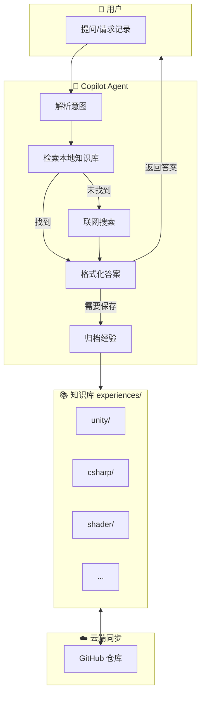
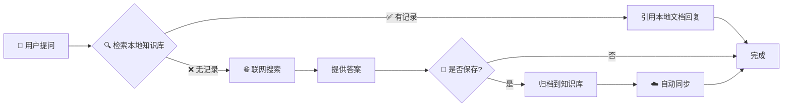
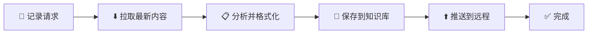
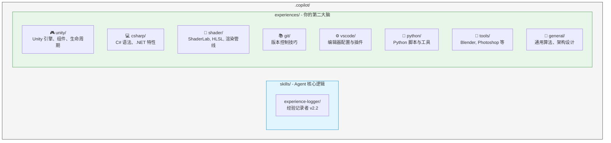
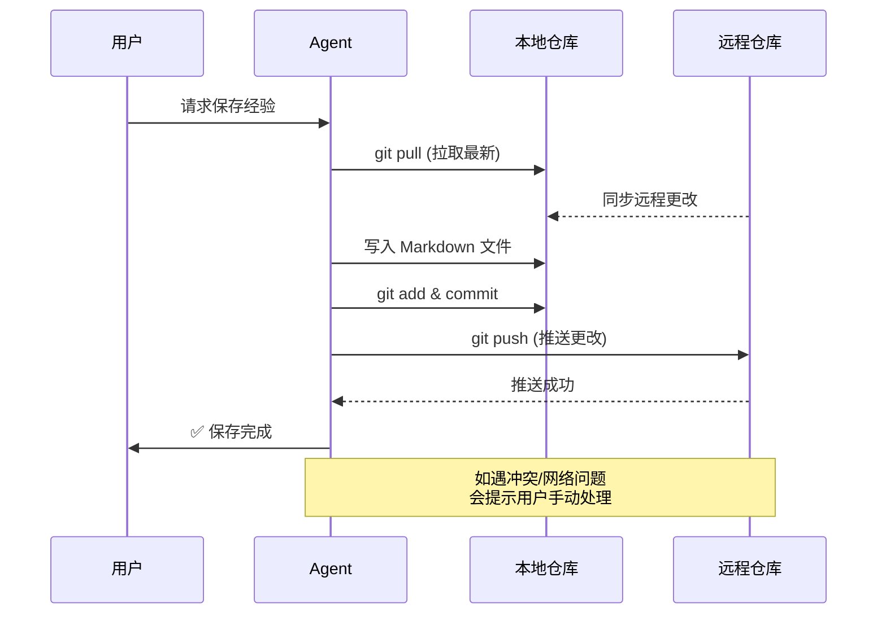

# 🧠 KT's Copilot Agent Skills (Experience Logger)

这是一个专为 VS Code Copilot 设计的 **持续学习型 Agent Skill**。

它不仅仅是一个简单的指令集，而是一个具备**记忆**和**成长**能力的私人技术助理。它能够拦截你的技术提问，自动检索本地知识库，如果找不到则进行联网搜索，并在解决问题后将方案自动归档到结构化的本地 Markdown 知识库中。

## 🌟 系统架构概览



## ✨ 核心特性

| 特性 | 说明 |
|:---:|:---|
| 📂 **结构化知识库** | 自动将经验按领域（Unity, C#, Shader, Python, Git 等）分类存储 |
| 🔍 **智能检索优先** | 遇到问题时，优先"回忆"（检索）本地已有的经验文档，避免重复搜索 |
| 🌐 **联网自动补全** | 若本地无相关记录，Agent 会自动联网搜索最新解决方案，并在对话结束时询问是否保存 |
| ☁️ **自动多端同步** | 保存经验前自动拉取最新内容，保存后自动推送到远程仓库，确保多设备间数据一致性 |

---

## 🚀 快速开始

### 1. 安装 (部署到新机器)

将此仓库克隆到用户主目录下的 `.copilot` 文件夹中：

```bash
# macOS / Linux
git clone https://github.com/KTSAMA001/KT-s-Agent-Skills.git ~/.copilot

# Windows (PowerShell)
# 注意：$HOME 代表用户主目录 (例如 C:\Users\Admin)
git clone https://github.com/KTSAMA001/KT-s-Agent-Skills.git $HOME\.copilot
```

### 2. 验证安装

打开 VS Code，在 GitHub Copilot Chat 中尝试输入以下指令进行测试：

> "你可以帮我记录一下今天关于 Unity 协程优化的经验吗？"

如果 Agent 能够识别并激活 `experience-logger` Skill，即表示安装成功。

---

## 💡 使用指南

这个 Skill 被设计为无缝融入你的日常开发流。你不需要刻意去"使用"它，只需像平常一样提问，或者显式要求记录。

### 场景 A：遇到新问题 (检索 + 学习)

**你问**: "Unity URP 里的 Shader 变体过多导致打包慢，怎么办？"

**Agent 的思考路径**:



### 场景 B：显式记录 (归档)

**你问**: "把刚才这段关于 C# 异步死锁的代码和解释记录下来。"



---

## 📂 知识库结构

所有经验都以标准 Markdown 格式保存在 `experiences/` 目录下，你可以随时手动编辑它们。



## 🛠️ 自定义配置

如果你想添加新的分类（例如 `前端/React`）：

1.  在 `experiences/` 下新建文件夹 `web`。
2.  在其中创建一个空的 `react.md`。
3.  Agent 会自动感知并开始向该文件写入内容。

## 🔄 同步与备份

### 自动同步流程

Agent 在记录或更新经验时会**自动执行**以下流程：



### 手动同步

如需手动同步，可使用以下命令：

```bash
# 在当前机器保存更改
cd ~/.copilot
git add .
git commit -m "update: 添加了关于 Unity 内存优化的笔记"
git push

# 在另一台机器获取更新
cd ~/.copilot
git pull
```

---
*Created by KT's Copilot Agent*
