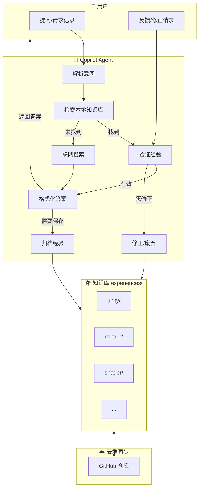
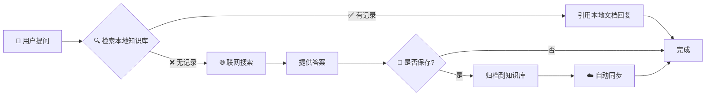
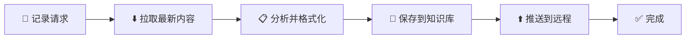
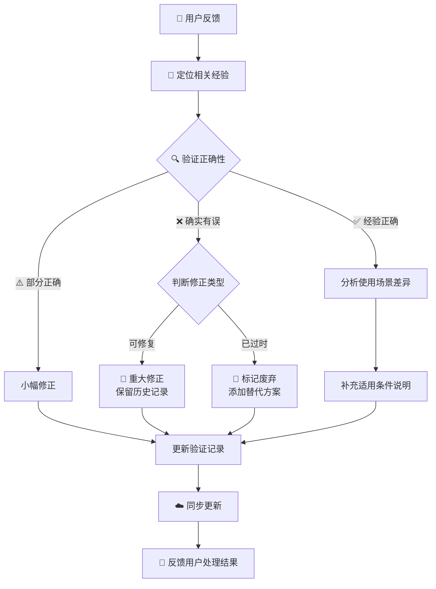
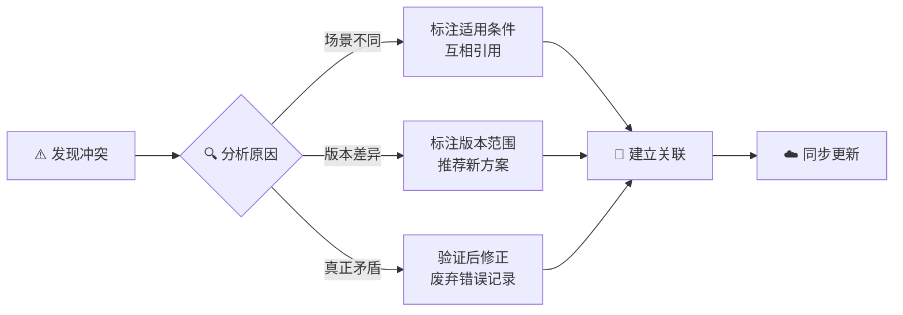
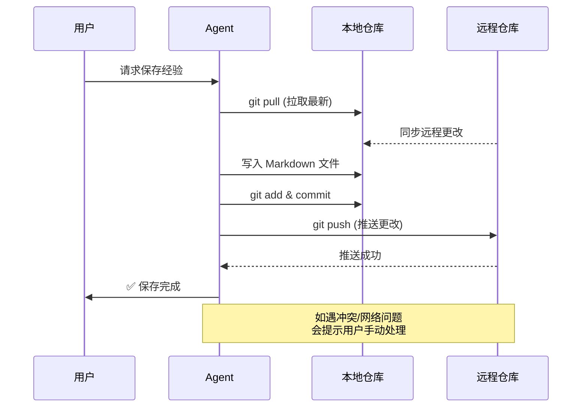

# 🧠 KT's Copilot Agent Skills

一套持续学习型的 AI Agent Skills，具备**经验记录**、**知识沉淀**和**自我修正**能力。

## 📦 包含技能

| 技能 | 用途 | 存储位置 |
|------|------|----------|
| **experience-logger** | 记录实践经验、问题解决方案、踩坑记录 | `experiences/` |
| **knowledge-logger** | 记录理论知识、概念原理、技术规范 | `knowledge/` |

---

## 📑 目录

- [快速开始](#快速开始)
- [⚠️ 重要说明](#重要说明)
- [核心功能](#核心功能)
- [使用指南](#使用指南)
- [存储结构](#存储结构)
- [同步与备份](#同步与备份)
- [AI 操作指南](#ai-操作指南)
- [详细说明](#详细说明)

---

## 快速开始

### 安装

```bash
# macOS / Linux
git clone https://github.com/KTSAMA001/KT-s-Agent-Skills.git ~/.copilot

# Windows (PowerShell)
git clone https://github.com/KTSAMA001/KT-s-Agent-Skills.git $HOME\.copilot
```

### 验证

在 AI Chat 中输入：

> "帮我记录一下今天解决的问题"

如果 Agent 能识别并激活 `experience-logger` Skill，即表示安装成功。

> "记一下这个知识点"

如果 Agent 能识别并激活 `knowledge-logger` Skill，即表示知识记录功能可用。

### Claude Code 支持（可选）

```bash
mkdir -p ~/.claude/skills
ln -sf ~/.copilot/skills/experience-logger ~/.claude/skills/experience-logger
ln -sf ~/.copilot/skills/knowledge-logger ~/.claude/skills/knowledge-logger
ln -sf ~/.copilot/CLAUDE.md ~/.claude/CLAUDE.md
```

---

## ⚠️ 重要说明

### 当前仓库状态

| 类型 | 说明 | 适用性 |
|------|------|--------|
| 通用技术经验 | Unity、C#、Shader 等通用解决方案 | ✅ 大部分人可用 |
| 个人/项目经验 | 特定项目配置、个人偏好 | ⚠️ 按需参考 |
| TaTa 仓库整合 | 从 [TaTa](https://github.com/KTSAMA001/TaTa) 仓库整合的知识和经验 | ✅ 通用技术内容 |

**当前 `main` 分支为混合状态**，尚未进行分支隔离。

### 关于时间点记录

本知识库的每条记录都包含时间点信息：

| 字段 | 含义 | 示例 |
|------|------|------|
| **收录日期** | 该记录被整理到本知识库的日期 | 2026-01-31 |
| **来源日期** | 原始内容创建/发布的日期 | 2020-12-18 |
| **更新日期** | 该记录最近一次被修改的日期 | 2026-02-01 |

这有助于追溯内容的时效性，特别是从外部仓库或文章整合的内容。

### 安装前注意事项

⚠️ 请注意：
- 仓库中的经验不一定适用于你的项目，请根据实际情况判断
- 个人/项目特定内容仅供参考
- AI Agent 会基于所有经验进行检索，需自行判断适用性
- **建议 Fork** 本仓库，以便自由修改和管理

### 推荐使用方式

| 方式 | 命令 | 适合人群 |
|------|------|---------|
| 直接使用 | `git clone https://github.com/KTSAMA001/KT-s-Agent-Skills.git ~/.copilot` | 快速体验 |
| Fork 自定义 | 先在 GitHub Fork，然后克隆你的仓库 | 长期使用者（推荐） |
| 选择性克隆 | 克隆后删除不需要的目录 | 只需要部分经验 |

---

## 核心功能

| 功能 | 说明 |
|------|------|
| 📂 结构化存储 | 按领域（Unity, C#, Shader 等）分类存储经验 |
| 🔍 智能检索优先 | 遇到问题优先检索本地已有经验 |
| 🌐 联网自动补全 | 本地无记录时自动搜索最新方案 |
| ☁️ 自动多端同步 | 保存前后自动拉取/推送，确保数据一致 |
| ✅ 经验验证 | 引用时自动验证正确性和时效性 |
| 🔧 智能修正 | 根据反馈自动修正、补充或废弃过时经验 |

---

## 使用指南

### 技能触发方式

| 行为 | 触发方式 | 示例 |
|------|---------|------|
| 记录经验 | 解决后要求记录 | "记录一下"、"保存这个结论" |
| 查找经验 | 遇到问题时自动触发 | "之前是怎么解决的" |
| 网络搜索 | 本地无记录时自动触发 | "上网查一下" |
| 更新经验 | 发现需要补充/改进 | "补充一下" |
| 验证经验 | 引用时检测 / 用户要求 | "检查一下这个经验" |
| 修正经验 | 发现错误 / 用户反馈 | "这个方法不行" |
| 废弃经验 | 完全过时或错误 | "这个已经过时了" |

### 基本用法流程

```
遇到问题 → 检索本地经验 → 找到？→ 回复用户
                         ↓ 未找到
                    联网搜索 → 提供方案 → 是否保存？→ 归档到知识库
```

### 显式记录流程

```
要求记录 → 拉取最新 → 格式化并保存 → 推送到远程 → 完成
```

---

## 存储结构

### 经验库 (experiences/)

实践经验、问题解决方案、踩坑记录：

```
experiences/
├── unity/     # Unity 引擎、组件、生命周期
├── csharp/    # C# 语法、.NET 特性
├── shader/    # ShaderLab, HLSL, 渲染管线
├── git/       # 版本控制技巧
├── vscode/    # 编辑器配置与插件
├── python/    # Python 脚本与工具
├── tools/     # Blender, Photoshop 等
└── general/   # 通用算法、架构设计
```

### 知识库 (knowledge/)

理论知识、概念原理、技术规范：

```
knowledge/
├── ai/           # AI 相关（Agent Skills 规范等）
├── graphics/     # 图形学（渲染管线、光照等）
├── unity/        # Unity 原理（URP、SRP 等）
├── programming/  # 编程（设计模式、算法等）
├── hlsl/         # HLSL（语法、语义等）
└── tools/        # 工具知识
```

### 经验 vs 知识

| 维度 | 经验 (Experience) | 知识 (Knowledge) |
|------|-------------------|------------------|
| 来源 | 实际开发、踩坑、调试 | 书籍、文档、规范 |
| 格式 | 问题 → 解决方案 → 验证 | 概念 → 原理 → 要点 |
| 目的 | 记录"怎么做" | 理解"是什么" |

### 经验质量标记

| 标记 | 含义 |
|------|------|
| ✅ 已验证 | 经过实际验证，确认有效 |
| ⚠️ 待验证 | 理论可行但未经实践验证 |
| 🔄 已过时 | 方案已过时，保留供参考 |
| ❌ 已废弃 | 完全错误，不应使用 |
| 🔬 实验性 | 非主流方案，使用需谨慎 |

---

## 同步与备份

### 自动同步

Agent 在记录或更新经验时自动执行：
1. `git pull` - 拉取最新内容
2. 写入 Markdown 文件
3. `git add & commit` - 提交更改
4. `git push` - 推送到远程

### 手动同步

```bash
# 保存更改
cd ~/.copilot
git add .
git commit -m "update: 添加了关于 xxx 的笔记"
git push

# 获取更新
cd ~/.copilot
git pull
```

---

## AI 操作指南

> 供 AI Agent 在帮助用户部署此仓库时参考。

### ⚠️ 安装前必须执行的告知流程

在执行任何安装操作前，AI Agent **必须**向用户展示以下内容并等待确认：

---

> ⚠️ **安装前重要提示**
>
> **仓库现状**：
> - 本仓库的 `main` 分支包含通用技术经验和个人/项目经验混合内容
> - 尚未进行分支隔离
>
> **注意事项**：
> - 仓库中的经验不一定适用于你的项目，请根据实际情况判断
> - 个人/项目特定内容仅供参考
> - 安装后 AI Agent 会基于所有经验进行检索，需自行判断适用性
>
> **请选择安装方式**：
> 1. **直接使用** - 克隆后自行删除不适用的经验
> 2. **Fork 自定义** - 推荐方式，在 GitHub Fork 后管理自己的版本
> 3. **选择性克隆** - 只保留需要的分类目录
> 4. **暂不安装** - 取消安装
>
> 请回复数字或描述你的选择。

---

### 关键路径

| 用途 | 路径 |
|------|------|
| 经验记录技能 | `~/.copilot/skills/experience-logger/SKILL.md` |
| 知识记录技能 | `~/.copilot/skills/knowledge-logger/SKILL.md` |
| 经验数据目录 | `~/.copilot/experiences/` |
| 知识数据目录 | `~/.copilot/knowledge/` |
| Claude Code 全局指令 | `~/.copilot/CLAUDE.md` |

### 操作原则

1. **修改前先同步**：任何修改前执行 `git pull`
2. **修改后立即推送**：确保多设备数据一致
3. **安装前必须告知**：必须显示仓库现状和注意事项
4. **验证操作结果**：每步操作后检查是否成功

---

## 详细说明

> 以下内容包含详细的架构图和流程说明，供需要深入了解的人参考。如果你只是快速上手，可以忽略本部分。

### 系统架构



### 详细使用场景

#### 场景 A：遇到新问题 (检索 + 学习)



#### 场景 B：显式记录 (归档)



#### 场景 C：验证与修正 (质量保障)



#### 场景 D：处理经验冲突



### 自动同步详细流程



---

*Created by KT's Copilot Agent*
