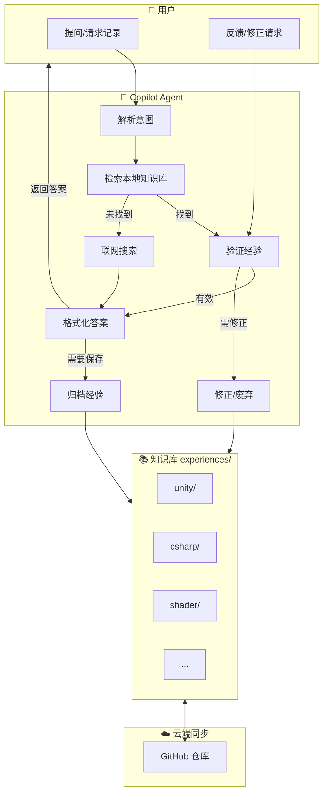
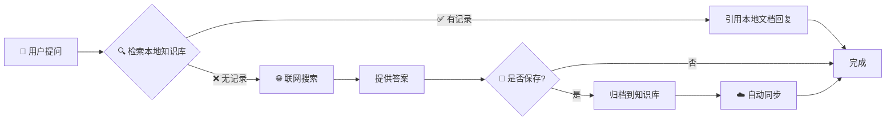
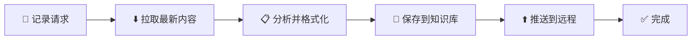
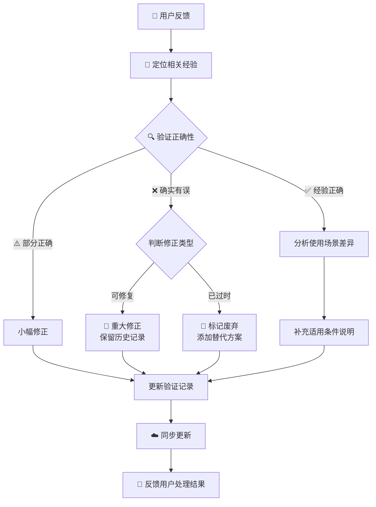
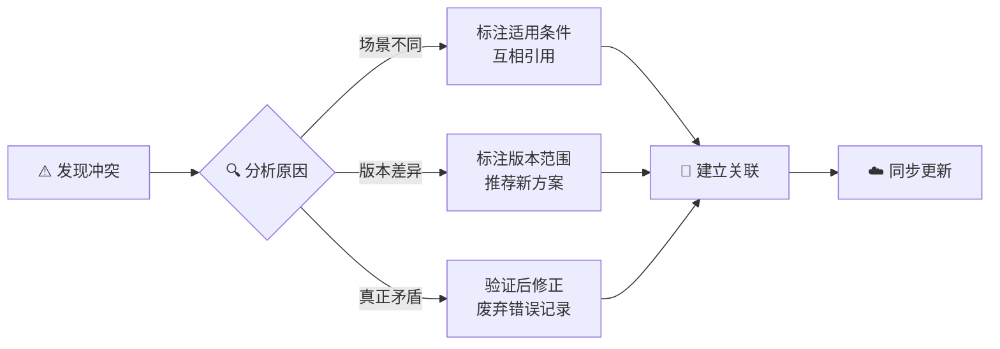
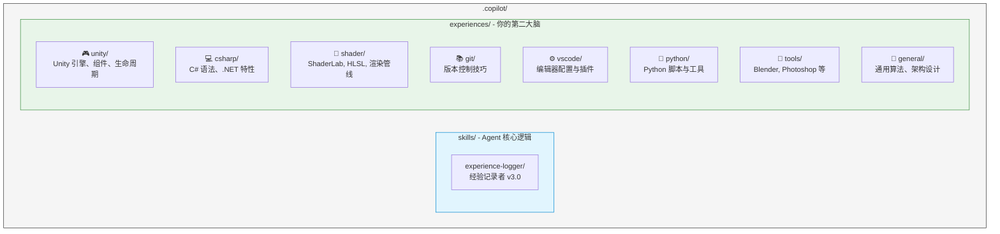
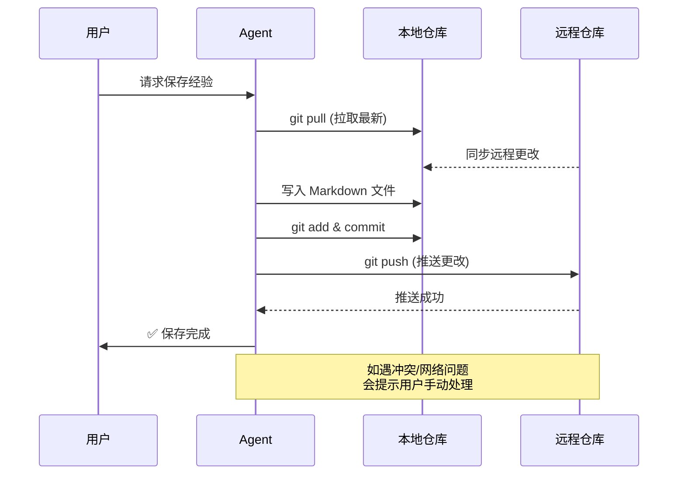

# 🧠 KT's Copilot Agent Skills (Experience Logger)

这是一个专为 VS Code Copilot 设计的 **持续学习型 Agent Skill**。

它不仅仅是一个简单的指令集，而是一个具备**记忆**、**成长**和**自我修正**能力的私人技术助理。它能够拦截你的技术提问，自动检索本地知识库，如果找不到则进行联网搜索，并在解决问题后将方案自动归档到结构化的本地 Markdown 知识库中。更重要的是，它能够**验证和修正**已有经验，确保知识库的准确性。

## 🌟 系统架构概览


```mermaid
flowchart TB
    subgraph User["👤 用户"]
        Q[提问/请求记录]
        FB[反馈/修正请求]
    end
    
    subgraph Agent["🤖 Copilot Agent"]
        direction TB
        Parse[解析意图]
        Search[检索本地知识库]
        Web[联网搜索]
        Format[格式化答案]
        Save[归档经验]
        Validate[验证经验]
        Correct[修正/废弃]
    end
    
    subgraph KB["📚 知识库 experiences/"]
        Unity[unity/]
        CSharp[csharp/]
        Shader[shader/]
        Other[...]
    end
    
    subgraph Sync["☁️ 云端同步"]
        Git[GitHub 仓库]
    end
    
    Q --> Parse
    Parse --> Search
    Search -->|找到| Validate
    Validate -->|有效| Format
    Validate -->|需修正| Correct
    Search -->|未找到| Web
    Web --> Format
    Format -->|需要保存| Save
    Save --> KB
    Correct --> KB
    KB <--> Git
    Format -->|返回答案| User
    FB --> Validate
```

## ✨ 核心特性

| 特性 | 说明 |
|:---:|:---|
| 📂 **结构化知识库** | 自动将经验按领域（Unity, C#, Shader, Python, Git 等）分类存储 |
| 🔍 **智能检索优先** | 遇到问题时，优先"回忆"（检索）本地已有的经验文档，避免重复搜索 |
| 🌐 **联网自动补全** | 若本地无相关记录，Agent 会自动联网搜索最新解决方案，并在对话结束时询问是否保存 |
| ☁️ **自动多端同步** | 保存经验前自动拉取最新内容，保存后自动推送到远程仓库，确保多设备间数据一致性 |
| ✅ **经验验证** | 引用经验时自动验证其正确性和时效性，检测版本/环境不匹配 |
| 🔧 **智能修正** | 根据用户反馈或验证结果，自动修正、补充或废弃过时经验 |
| 🔗 **冲突处理** | 检测并处理经验间的矛盾，建立关联引用，标注适用场景 |

---

## 🚀 快速开始

### 1. 安装 (部署到新机器)

将此仓库克隆到用户主目录下的 `.copilot` 文件夹中：

```bash
# macOS / Linux
git clone https://github.com/KTSAMA001/KT-s-Agent-Skills.git ~/.copilot

# Windows (PowerShell)
# 注意：$HOME 代表用户主目录 (例如 C:\Users\Admin)
git clone https://github.com/KTSAMA001/KT-s-Agent-Skills.git $HOME\.copilot
```

### 2. 验证安装

打开 VS Code，在 GitHub Copilot Chat 中尝试输入以下指令进行测试：

> "你可以帮我记录一下今天关于 Unity 协程优化的经验吗？"

如果 Agent 能够识别并激活 `experience-logger` Skill，即表示安装成功。

---

## 💡 使用指南

这个 Skill 被设计为无缝融入你的日常开发流。你不需要刻意去"使用"它，只需像平常一样提问，或者显式要求记录。

### 🎯 技能触发行为一览

| 行为 | 触发方式 | 示例 |
|:---:|:---|:---|
| 📝 **记录经验** | 解决问题后 / 用户要求记录 | "记录一下"、"保存这个结论"、"归档这个问题" |
| 🔍 **查找经验** | 遇到技术问题时自动触发 | "之前是怎么解决的"、"有没有相关经验" |
| 🌐 **网络搜索** | 本地无记录时自动触发 | "上网查一下"、"搜索一下最新方案" |
| 🔄 **更新经验** | 发现需要补充/改进 | "补充一下"、"有更好的方案" |
| ✅ **验证经验** | 引用时检测 / 用户要求 | "检查一下这个经验"、"验证一下对不对" |
| 🔧 **修正经验** | 发现错误 / 用户反馈 | "这个方法不行"、"不对"、"有问题" |
| ❌ **废弃经验** | 完全过时或错误 | "这个已经过时了"、"这是错的" |

### 场景 A：遇到新问题 (检索 + 学习)

**你问**: "Unity URP 里的 Shader 变体过多导致打包慢，怎么办？"

**Agent 的思考路径**:


```mermaid
flowchart LR
    A[📝 用户提问] --> B{🔍 检索本地知识库}
    B -->|✅ 有记录| C[引用本地文档回复]
    B -->|❌ 无记录| D[🌐 联网搜索]
    D --> E[提供答案]
    E --> F{💾 是否保存?}
    F -->|是| G[归档到知识库]
    G --> H[☁️ 自动同步]
    C --> I[完成]
    F -->|否| I
    H --> I
```

### 场景 B：显式记录 (归档)

**你问**: "把刚才这段关于 C# 异步死锁的代码和解释记录下来。"


```mermaid
flowchart LR
    A[📝 记录请求] --> B[⬇️ 拉取最新内容]
    B --> C[📋 分析并格式化]
    C --> D[💾 保存到知识库]
    D --> E[⬆️ 推送到远程]
    E --> F[✅ 完成]
```

### 场景 C：验证与修正 (质量保障)

**你说**: "你之前记录的那个方法好像不对，我试了报错。"

**Agent 的处理流程**:


```mermaid
flowchart TB
    A[🔔 用户反馈] --> B[📍 定位相关经验]
    B --> C{🔍 验证正确性}
    C -->|✅ 经验正确| D[分析使用场景差异]
    C -->|⚠️ 部分正确| E[小幅修正]
    C -->|❌ 确实有误| F{判断修正类型}
    
    F -->|可修复| G[🔧 重大修正<br/>保留历史记录]
    F -->|已过时| H[🔄 标记废弃<br/>添加替代方案]
    
    D --> I[补充适用条件说明]
    E --> J[更新验证记录]
    G --> J
    H --> J
    I --> J
    
    J --> K[☁️ 同步更新]
    K --> L[📢 反馈用户处理结果]
```

### 场景 D：处理经验冲突

**你问**: "为什么有两个地方说的不一样？"


```mermaid
flowchart LR
    A[⚠️ 发现冲突] --> B{🔍 分析原因}
    B -->|场景不同| C[标注适用条件<br/>互相引用]
    B -->|版本差异| D[标注版本范围<br/>推荐新方案]
    B -->|真正矛盾| E[验证后修正<br/>废弃错误记录]
    C --> F[🔗 建立关联]
    D --> F
    E --> F
    F --> G[☁️ 同步更新]
```

---

## 📂 知识库结构

所有经验都以标准 Markdown 格式保存在 `experiences/` 目录下，你可以随时手动编辑它们。


```mermaid
graph TD
    subgraph Root[".copilot/"]
        subgraph Skills["skills/ - Agent 核心逻辑"]
            EL["experience-logger/<br/>经验记录者 v3.0"]
        end
        
        subgraph Experiences["experiences/ - 你的第二大脑"]
            Unity["🎮 unity/<br/>Unity 引擎、组件、生命周期"]
            CSharp["💻 csharp/<br/>C# 语法、.NET 特性"]
            Shader["🎨 shader/<br/>ShaderLab, HLSL, 渲染管线"]
            Git["📚 git/<br/>版本控制技巧"]
            VSCode["⚙️ vscode/<br/>编辑器配置与插件"]
            Python["🐍 python/<br/>Python 脚本与工具"]
            Tools["🔧 tools/<br/>Blender, Photoshop 等"]
            General["📖 general/<br/>通用算法、架构设计"]
        end
    end
    
    style Root fill:#f5f5f5,stroke:#333
    style Skills fill:#e1f5fe,stroke:#0288d1
    style Experiences fill:#e8f5e9,stroke:#388e3c
```

## 📊 经验质量标记

每条经验记录都带有状态标记，帮助你快速判断其可信度：

| 标记 | 含义 | 说明 |
|:---:|:---|:---|
| ✅ **已验证** | 经过实际验证 | 经过实践检验，确认有效的经验 |
| ⚠️ **待验证** | 理论可行 | 新记录或来自网络搜索，尚未经过实践验证 |
| 🔄 **已过时** | 保留供参考 | 方案已过时，但保留历史记录供参考 |
| ❌ **已废弃** | 不应使用 | 经验证发现的错误经验，已标记废弃 |
| 🔬 **实验性** | 使用需谨慎 | 非主流或创新方案，尚未广泛验证 |

## 🛠️ 自定义配置

如果你想添加新的分类（例如 `前端/React`）：

1.  在 `experiences/` 下新建文件夹 `web`。
2.  在其中创建一个空的 `react.md`。
3.  Agent 会自动感知并开始向该文件写入内容。

## 🔄 同步与备份

### 自动同步流程

Agent 在记录或更新经验时会**自动执行**以下流程：


```mermaid
sequenceDiagram
    participant U as 用户
    participant A as Agent
    participant L as 本地仓库
    participant R as 远程仓库

    U->>A: 请求保存经验
    A->>L: git pull (拉取最新)
    R-->>L: 同步远程更改
    A->>L: 写入 Markdown 文件
    A->>L: git add & commit
    A->>R: git push (推送更改)
    R-->>A: 推送成功
    A->>U: ✅ 保存完成
    
    Note over A,R: 如遇冲突/网络问题<br/>会提示用户手动处理
```

### 手动同步

如需手动同步，可使用以下命令：

```bash
# 在当前机器保存更改
cd ~/.copilot
git add .
git commit -m "update: 添加了关于 Unity 内存优化的笔记"
git push

# 在另一台机器获取更新
cd ~/.copilot
git pull
```

---
*Created by KT's Copilot Agent*
