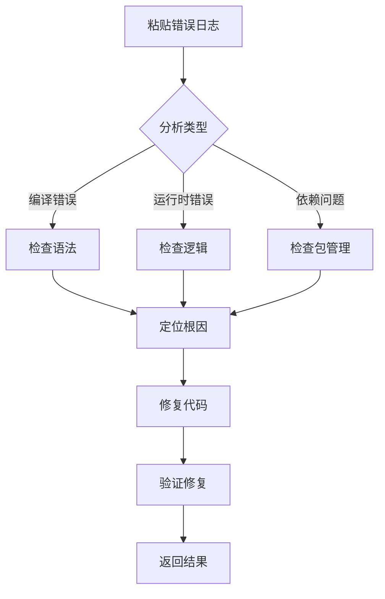
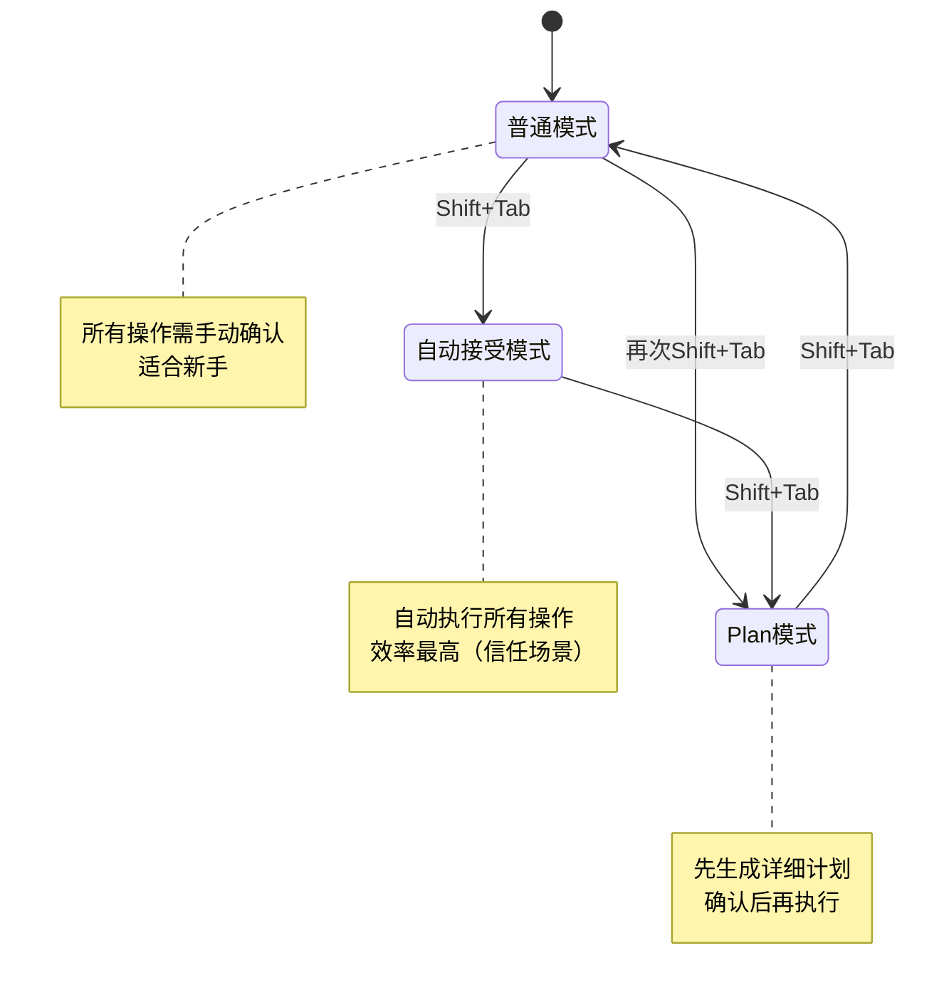
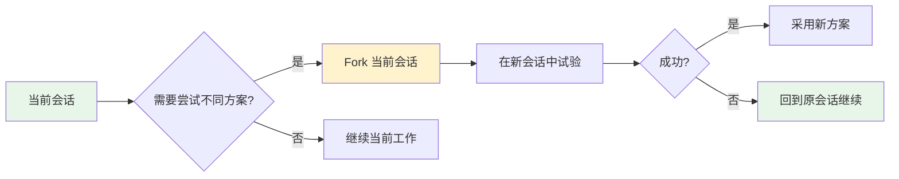

# Claude Code 经验

> Anthropic Claude Code AI 编程助手相关经验
>
> 包含：斜杠命令、Fork 会话、权限模式、MCP 扩展等

---

## Claude Code 完整指南

**日期**：2026-01-30
**标签**：#ai #tools #reference #claude-code
**状态**：✅ 已验证

**问题/场景**：

Claude Code 是什么？有哪些核心功能？如何最大化发挥其价值？

**解决方案/结论**：

### 一、Claude Code 是什么？

Claude Code 是 Anthropic 推出的**终端原生 AI 编程助手**，直接在终端中运行，无需切换 IDE 或聊天窗口。


**核心定位**：项目级开发助手，而非文件级代码补全工具

### 二、核心优势

| 优势 | 说明 | 带来价值 |
|------|------|----------|
| **终端原生** | 直接在 CLI 中运行 | 无需切换窗口，工作流不中断 |
| **200k 超长上下文** | 比传统工具多 10 倍以上 | 理解整个大型项目 |
| **支持 40+ 语言** | 覆盖主流编程语言 | 适用于全栈开发 |
| **项目级视野** | 扫描整个代码库 | 全局理解架构和依赖 |
| **直接操作** | 可编辑文件、运行命令、创建提交 | 所想即所得，无需手动复制 |
| **MCP 扩展** | 可连接外部工具 | 无限扩展能力 |

### 三、与 VS Code Copilot 对比


| 特性 | VS Code Copilot | Claude Code |
|------|----------------|-------------|
| **定位** | 文件级代码补全 | 项目级开发助手 |
| **上下文** | 单文件为主 | 200k 超长上下文 |
| **核心功能** | 实时代码补全 | 全局规划、自动化、调试 |
| **适用场景** | 日常编码、局部逻辑 | 复杂项目、重构、文档 |
| **推荐用法** | 搭配使用效果最佳 | 搭配使用效果最佳 |

**结论**：两者不是替代关系，而是**互补关系**。建议同时使用：
- **VS Code Copilot**：负责实时代码补全
- **Claude Code**：负责整体方案和复杂任务

### 四、核心功能详解

#### 4.1 代码生成（自然语言转代码）

```
你：帮我用 React + TypeScript 写一个 TodoList 组件，要求支持添加、删除和状态切换，使用 Tailwind CSS 样式

Claude Code：
  1. 分析需求
  2. 规划方案
  3. 创建文件
  4. 编写代码
  5. 确保可运行
```

**支持场景**：
- 前端组件（React, Vue, Svelte 等）
- 后端接口（Spring Boot, Gin, Express 等）
- 数据脚本（SQL, Python 数据处理）
- 配置文件（Docker, Kubernetes 等）

#### 4.2 调试修复（一键解决问题）



**支持输入方式**：
- 文本错误日志
- 截图调试（macOS: `Ctrl+V`, Windows: `Alt+V`）

#### 4.3 代码库导航（全局理解项目）

```
你：分析 @src/services/api.ts 的接口设计
Claude Code：
  - 扫描文件
  - 分析接口结构
  - 总结设计模式
  - 提出优化建议

你：这个项目的权限认证逻辑是怎样的？
Claude Code：
  - 扫描认证相关文件
  - 追踪调用链
  - 绘制流程图
  - 解释安全机制
```

#### 4.4 自动化任务（解放重复劳动）

| 任务类型 | 示例命令 | 说明 |
|---------|----------|------|
| 修复 lint | `帮我批量修复项目中的所有 ESLint 错误` | 自动修复代码规范问题 |
| 解决冲突 | `处理当前分支的 Git 合并冲突` | 智能合并代码 |
| 生成文档 | `为 @src/utils/date.ts 写详细注释和使用示例` | 自动生成文档 |
| 运行测试 | `claude -p "检测新提交的代码，生成测试用例并运行"` | CI 集成 |
| 重构代码 | `重构 @src/components/Button 组件，提取通用逻辑` | 代码优化 |

### 五、进阶功能

#### 5.1 权限模式切换（`Shift + Tab`）



#### 5.2 高效交互技巧

| 技巧 | 用法 | 示例 |
|------|------|------|
| 文件提及 | `@文件路径` | `分析 @src/App.tsx 的结构` |
| Bash 模式 | `!命令` | `! git status` |
| 多行输入 | `\` + Enter 或 `Shift+Enter` | 输入复杂需求 |
| 快捷键 | `Ctrl+R` 搜索历史 | 快速查找之前的问题 |

#### 5.3 记忆管理（CLAUDE.md）

`CLAUDE.md` 是项目的"第二大脑"，记录项目架构、编码规范、数据库结构等信息。


**CLAUDE.md 内容示例**：

```markdown
# 项目规范

## 代码风格
- 使用 ESLint + Prettier
- 单引号，无分号
- 组件命名：PascalCase

## 架构说明
- 前端：React + TypeScript + Tailwind
- 后端：Node.js + Express
- 数据库：PostgreSQL

## 接口规范
- 所有请求统一使用 @src/services/request.ts
- 错误处理统一格式：{ code, message, data }
```

#### 5.4 自定义斜杠命令

在项目根目录创建 `.claude/commands/review.md`：

```markdown
# /review 命令逻辑
1. 检查最近修改的代码是否符合项目规范
2. 识别潜在性能问题和安全漏洞
3. 建议补充必要的测试用例
```

使用：输入 `/review` 即可执行自定义流程。

#### 5.5 MCP 扩展（连接外部工具）

```json
// ~/.config/claude/settings.json
{
  "mcp_servers": {
    "github": {
      "command": "npx",
      "args": ["-y", "@model-context-protocol/server-github"],
      "env": {
        "GITHUB_PERSONAL_ACCESS_TOKEN": "ghp_xxx"
      }
    }
  }
}
```

**常用 MCP 服务器**：
- GitHub：代码仓库操作
- Google Drive：文件管理
- Figma：设计协作
- Jira：项目管理

### 六、使用场景矩阵

| 场景 | Claude Code | VS Code Copilot | 推荐选择 |
|------|-------------|-----------------|----------|
| 新建项目骨架 | ✅ 擅长 | ⚠️ 较弱 | Claude Code |
| 重构代码 | ✅ 全局理解 | ⚠️ 单文件 | Claude Code |
| 修复 bug | ✅ 上下文丰富 | ⚠️ 需复制 | Claude Code |
| 实时代码补全 | ⚠️ 需手动 | ✅ 实时 | Copilot |
| 快速生成函数 | ⚠️ 需切换 | ✅ 就在 IDE | Copilot |
| 处理 Git 冲突 | ✅ 直接操作 | ❌ 不支持 | Claude Code |
| 生成文档 | ✅ 理解项目 | ⚠️ 局部理解 | Claude Code |
| 学习新框架 | ✅ 项目级讲解 | ⚠️ 片段式 | Claude Code |

### 七、安装与配置

#### 7.1 安装

```bash
# macOS / Linux / WSL
curl -fsSL https://claude.ai/install.sh | bash

# Windows PowerShell
irm https://claude.ai/install.ps1 | iex

# 验证安装
claude --version
```

#### 7.2 首次认证

```bash
cd your-project
claude
# 按提示在浏览器中完成 OAuth 授权
```

### 八、最佳实践

1. **善用 CLAUDE.md**：记录项目规范，避免重复解释
2. **先 Plan 再执行**：复杂任务先切换到 Plan 模式
3. **合理使用权限模式**：信任场景用自动接受，新手用普通模式
4. **定期压缩上下文**：大型项目用 `/compact` 节省 token
5. **配置 .claudeignore**：排除 `node_modules/` 等不必要的目录
6. **结合 VS Code Copilot**：实时补全 + 项目级规划 = 最佳组合

### 九、常见问题

| 问题 | 解决方案 |
|------|---------|
| 命令未找到 | 检查环境变量，将 npm 全局路径添加到 PATH |
| 认证失败 | 运行 `/logout` 退出登录，重新授权 |
| 权限被拒 | 运行 `/permissions` 配置信任路径 |
| 性能慢 | 使用 `/compact` 压缩上下文，配置 `.claudeignore` |

**参考链接**：

- [Claude Code 官方文档](https://code.claude.com/docs/en)
- [Claude Code Skills 官方文档](https://code.claude.com/docs/en/skills)
- [MCP 官方规范](https://modelcontextprotocol.io/)
- [阿里云全攻略文章](https://developer.aliyun.com/article/1705912)

**验证记录**：

- [2026-01-30] 初次记录，来源：[阿里云全攻略](https://developer.aliyun.com/article/1705912)、官方文档整合

---

## Fork 会话功能

**日期**：2026-01-30
**标签**：#ai #tools #reference #claude-code
**状态**：✅ 已验证

**问题/场景**：

在复杂任务中想尝试不同的方案，但不希望丢失当前会话的进度。

**解决方案/结论**：

使用 `--fork-session` CLI 标志复制当前会话，创建一个独立的分支会话。

#### 使用方式

```bash
# 基本用法：复制当前会话
claude --fork-session

# 结合恢复使用
claude --resume <session-id> --fork-session

# 从特定会话 fork
claude --continue <session-id> --fork-session
```

#### 适用场景

| 场景 | 说明 |
|------|------|
| 尝试不同方案 | 想从某个点尝试不同的实现方法，失败了可以回退 |
| 并行探索 | 同时探索多个技术方案，各自独立进行 |
| 实验性尝试 | 不确定方案是否可行，创建分支会话测试 |

#### 工作流程



#### 关键特点

- **独立会话 ID**：Fork 的会话有独立的 UUID
- **完全隔离**：两个会话互不影响
- **随时切换**：可以通过 `/resume` 在不同会话间切换
- **双 Esc 快捷键**：`Esc+Esc` 打开会话选择器，包括 fork 的会话

**参考链接**：

- [GitHub Issue: Clone/duplicate conversation](https://github.com/anthropics/claude-code/issues/12941)
- [Changelog: Improved fork session hint](https://code.claude.com/docs/en/changelog)

---

## 完整斜杠命令列表

**日期**：2026-01-30
**标签**：#ai #tools #reference #claude-code
**状态**：✅ 已验证

**问题/场景**：

Claude Code 有哪些内置斜杠命令？每个命令的具体作用是什么？

**解决方案/结论**：

### 内置命令完整列表

| 命令 | 用途 | 分类 |
|--------|------|------|
| `/add-dir` | 添加额外的工作目录 | 项目管理 |
| `/agents` | 管理自定义 AI 子代理 | 代理管理 |
| `/bashes` | 列出和管理后台任务 | 任务管理 |
| `/bug` | 报告错误（发送给 Anthropic） | 反馈 |
| `/clear` | 清除对话历史 | 会话管理 |
| `/compact [instructions]` | 压缩对话，可选择性地提供焦点说明 | 上下文管理 |
| `/config` | 打开设置界面（配置选项卡） | 配置 |
| `/context` | 将当前上下文使用情况可视化为彩色网格 | 监控 |
| `/cost` | 显示令牌使用统计 | 成本管理 |
| `/doctor` | 检查您的 Claude Code 安装的健康状况 | 诊断 |
| `/exit` | 退出 REPL | 会话管理 |
| `/export [filename]` | 将当前对话导出到文件或剪贴板 | 导出 |
| `/help` | 获取使用帮助 | 帮助 |
| `/hooks` | 管理工具事件的钩子配置 | 高级配置 |
| `/ide` | 管理 IDE 集成并显示状态 | IDE 集成 |
| `/init` | 使用 `CLAUDE.md` 指南初始化项目 | 项目初始化 |
| `/install-github-app` | 为存储库设置 Claude GitHub Actions | 集成 |
| `/login` | 切换 Anthropic 账户 | 账户管理 |
| `/logout` | 从您的 Anthropic 账户登出 | 账户管理 |
| `/mcp` | 管理 MCP 服务器连接和 OAuth 身份验证 | MCP 管理 |
| `/memory` | 编辑 `CLAUDE.md` 内存文件 | 记忆管理 |
| `/model` | 选择或更改 AI 模型 | 模型选择 |
| `/output-style [style]` | 直接设置输出样式或从选择菜单中选择 | 界面 |
| `/permissions` | 查看或更新权限 | 权限管理 |
| `/plan` | 直接从提示进入计划模式 | 模式切换 |
| `/plugin` | 管理 Claude Code 插件 | 插件管理 |
| `/pr-comments` | 查看拉取请求注释 | Git 集成 |
| `/privacy-settings` | 查看和更新您的隐私设置 | 隐私 |
| `/release-notes` | 查看发布说明 | 版本信息 |
| `/rename <name>` | 重命名当前会话以便于识别 | 会话管理 |
| `/remote-env` | 配置远程会话环境（claude.ai 订阅者） | 远程会话 |
| `/resume [session]` | 按 ID 或名称恢复对话，或打开会话选择器 | 会话管理 |
| `/review` | 请求代码审查 | 代码质量 |
| `/rewind` | 回退对话和/或代码 | 撤销 |
| `/sandbox` | 启用沙箱化 bash 工具，具有文件系统和网络隔离 | 安全 |
| `/security-review` | 对当前分支上的待处理更改完成安全审查 | 安全 |
| `/stats` | 可视化每日使用情况、会话历史、连胜记录和模型偏好 | 统计 |
| `/status` | 打开设置界面（状态选项卡），显示版本、模型、账户和连接性 | 状态查看 |
| `/statusline` | 设置 Claude Code 的状态行 UI | 界面 |
| `/teleport` | 按会话 ID 从 claude.ai 恢复远程会话，或打开选择器（claude.ai 订阅者） | 远程会话 |
| `/terminal-setup` | 为换行安装 Shift+Enter 键绑定（VS Code、Alacritty、Zed、Warp） | 终端设置 |
| `/theme` | 更改颜色主题 | 界面 |
| `/todos` | 列出当前 TODO 项目 | 任务管理 |
| `/usage` | 仅适用于订阅计划：显示计划使用限制和速率限制状态 | 使用监控 |
| `/vim` | 进入 vim 模式以在插入和命令模式之间交替 | 编辑器 |

### 按功能分类

#### 会话管理
```
/clear        - 清除对话历史
/resume [id]  - 恢复对话
/rename <name> - 重命名当前会话
/export [file]  - 导出当前对话
/exit         - 退出 REPL
```

#### 项目管理
```
/add-dir      - 添加额外的工作目录
/init         - 初始化项目（创建 CLAUDE.md）
```

#### 上下文与记忆
```
/compact [instructions]  - 压缩对话
/context              - 查看上下文使用
/memory              - 编辑 CLAUDE.md
```

#### 代理与任务
```
/agents    - 管理子代理
/bashes    - 列出后台任务
/todos     - 列出 TODO 项目
```

#### 配置与设置
```
/config           - 打开设置界面
/model            - 选择 AI 模型
/permissions       - 查看或更新权限
/privacy-settings  - 隐私设置
/theme            - 更改颜色主题
/output-style     - 设置输出样式
/status           - 状态选项卡
/statusline       - 状态行 UI
/terminal-setup   - 终端键绑定
```

#### 集成与工具
```
/ide                 - IDE 集成
/mcp                 - MCP 服务器管理
/plugin              - 插件管理
/install-github-app  - GitHub Actions 集成
/hooks              - 钩子配置
```

#### Git 相关
```
/pr-comments      - 查看拉取请求注释
```

#### 代码质量与安全
```
/review           - 请求代码审查
/security-review  - 安全审查
```

#### 账户与成本
```
/login     - 切换账户
/logout    - 登出账户
/cost      - Token 使用统计
/usage     - 计划使用限制
```

#### 诊断与帮助
```
/doctor - 检查安装健康状态
/help   - 获取使用帮助
/bug    - 报告错误
```

#### 模式切换
```
/plan      - 进入计划模式
/sandbox  - 启用沙箱模式
```

#### 远程与撤销
```
/rewind      - 回退对话或代码
/remote-env  - 远程会话环境
/teleport     - 恢复远程会话
```

#### 编辑器模式
```
/vim - 进入 vim 模式
```

**参考链接**：

- [Claude Code 斜杠命令官方文档](https://code.claude.com/docs/zh-CN/slash-commands)

**验证记录**：

- [2026-01-30] 初次记录，来源：[官方文档](https://code.claude.com/docs/zh-CN/slash-commands)


---

## Claude Code 作为 Agent 框架接入多种模型

**日期**：2026-01-31
**标签**：#ai #tools #reference #claude-code
**状态**：✅ 已验证

**问题/场景**：

想了解 Claude Code 是否可以作为"中转层"，连接 IDE 后使用 GLM 或其他非 Anthropic 模型，以及具体支持哪些模型提供商。

**解决方案/结论**：

**Claude Code 本质上是一个 Agent 框架**，不绑定特定模型，通过配置 `ANTHROPIC_BASE_URL` 等环境变量可接入不同的后端 API。

### 官方支持的提供商

| 提供商 | 环境变量 | 说明 |
|--------|----------|------|
| **Anthropic API** | `ANTHROPIC_BASE_URL` | 默认，直连 Anthropic |
| **Amazon Bedrock** | `CLAUDE_CODE_USE_BEDROCK=1` | 通过 AWS 调用 Claude |
| **Google Vertex AI** | `CLAUDE_CODE_USE_VERTEX=1` | 通过 GCP 调用 Claude |
| **Microsoft Foundry** | `CLAUDE_CODE_USE_FOUNDRY=1` | 通过 Azure 调用 Claude |

### 通过 LLM Gateway 扩展更多模型

使用 **LiteLLM** 或类似代理可接入几乎任何兼容 Anthropic/OpenAI API 格式的模型。

理论上可接入的模型：

| 模型系列 | 提供商 |
|----------|--------|
| **GLM-4.7 / GLM-4.5** | 智谱 AI (bigmodel.cn) |
| **GPT-4 / GPT-4o** | OpenAI |
| **Gemini Pro / Ultra** | Google |
| **DeepSeek** | DeepSeek |
| **Qwen (通义千问)** | 阿里云 |
| **Moonshot (Kimi)** | 月之暗面 |
| **本地模型** | Ollama、vLLM、LocalAI 等 |

### 智谱 GLM 配置示例

智谱提供了 **Anthropic 兼容 API 端点**，在 `~/.claude/settings.json` 中配置：

```json
{
  "env": {
    "ANTHROPIC_BASE_URL": "https://open.bigmodel.cn/api/anthropic",
    "ANTHROPIC_AUTH_TOKEN": "your-api-key",
    "ANTHROPIC_DEFAULT_HAIKU_MODEL": "glm-4.5-air",
    "ANTHROPIC_DEFAULT_SONNET_MODEL": "glm-4.7",
    "ANTHROPIC_DEFAULT_OPUS_MODEL": "glm-4.7"
  }
}
```

### 关键要点

- Claude Code **界面显示的仍是 Anthropic 模型名**，但实际调用的是配置的后端模型
- 后端 API 需**兼容 Anthropic Messages 格式**（或通过网关转换）
- 使用 `/model` 命令可查看/切换可用模型

**参考链接**：

- [Claude Code Model Configuration](https://code.claude.com/docs/en/model-config) - 模型配置官方文档
- [Claude Code LLM Gateway](https://code.claude.com/docs/en/llm-gateway) - LiteLLM 等网关配置
- [Claude Code on Amazon Bedrock](https://code.claude.com/docs/en/amazon-bedrock) - AWS Bedrock 配置
- [智谱 GLM Coding Plan](https://docs.bigmodel.cn/cn/guide/develop/claude) - 智谱 AI Claude 兼容 API

**验证记录**：

- [2026-01-31] 初次记录，来源：官方文档 + 实践验证。已成功通过智谱 API 使用 GLM-4.7 模型。
