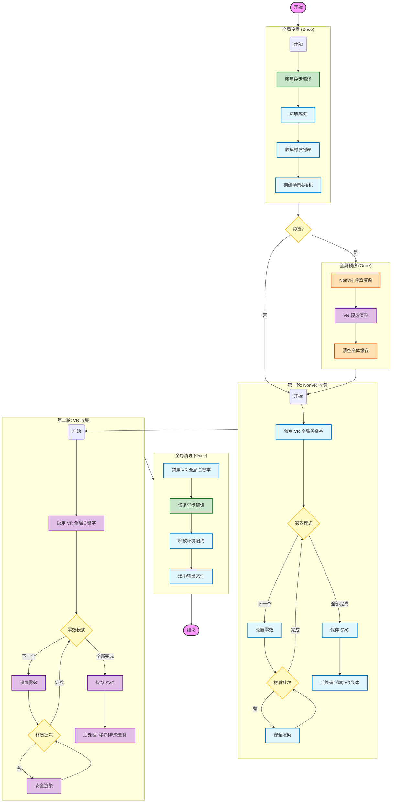
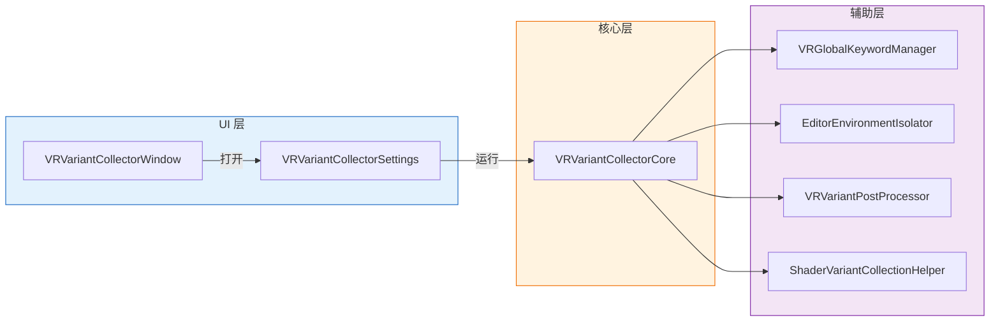
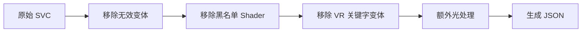

# VR 变体收集器 - 架构与流程图解

> **说明**：本文档包含 Mermaid 图表源码。
> 请在 VS Code 中点击右上角的 **"Open Preview to the Side"** (快捷键 `Ctrl+K V`) 查看图形化渲染效果。
> 
> **最后更新**：2025-12-12

---

## 1. 核心执行流程 (Execution Flow)

此流程图描述了 `VRVariantCollectorCore.RunCollection` 的完整生命周期。

**核心特性**：
- **双文件收集**：NonVR 文件 + VR 文件，分别收集不同的变体
- **全局 VR 关键字激活**：通过 `VRGlobalKeywordManager` 控制 `STEREO_MULTIVIEW_ON`
- 同步编译模式（`EditorSettings.asyncShaderCompilation = false`）
- 雾效模式外层循环架构



---

## 2. 双文件收集架构详解

### 2.1 输出文件说明

```
SavePath: Assets/ShaderVariants/GameShaderVariants.shadervariants

实际输出:
├── GameShaderVariants_NonVR.shadervariants   ← 不含 VR 关键字的变体（用于打包保留 Shader）
├── GameShaderVariants_NonVR.json             ← NonVR 清单
├── GameShaderVariants_VR.shadervariants      ← 含 VR 关键字的变体（用于运行时预热）
└── GameShaderVariants_VR.json                ← VR 清单
```

### 2.2 双文件设计目的

| 文件 | 主要用途 | 说明 |
|------|----------|------|
| **NonVR SVC** | 打包时保留 Shader | 确保相关 Shader 不会因为"没有被使用的变体"而被剔除 |
| **VR SVC** | 运行时预热 | 只包含 VR 变体，减少预热时间（约节省一半） |

### 2.3 VR 关键字说明

| 平台 | 全局关键字 | 说明 |
|------|-----------|------|
| Quest (Multiview) | `STEREO_MULTIVIEW_ON` | Meta Quest 的多视图渲染 |
| PCVR (Instancing) | `STEREO_INSTANCING_ON` | PC VR 的实例化立体渲染 |

**技术细节**：
- 这些是 Unity 引擎内置的**全局关键字**，无法通过材质属性设置
- 只有当 XR 系统激活时，Unity 才会在渲染时启用这些关键字
- 本工具通过 `VRGlobalKeywordManager.EnableVRKeyword()` 在编辑器中模拟激活

---

## 3. 类结构与关系 (Class Architecture)

### 3.1 调用层级图



### 3.2 类职责说明

| 层级 | 类名 | 职责 |
|:----:|------|------|
| **UI** | `VRVariantCollectorWindow` | 菜单入口，打开工具窗口 |
| **UI** | `VRVariantCollectorSettings` | Odin 面板，用户配置与操作按钮 |
| **核心** | `VRVariantCollectorCore` | 收集流程控制，协程驱动 |
| **核心** | `VRVariantCollectorConfig` | 配置数据容器（由 Settings 生成） |
| **核心** | `CollectionContext` | 运行时状态上下文（Core 内部维护） |
| **辅助** | `VRGlobalKeywordManager` | VR 全局关键字开关（静态类） |
| **辅助** | `EditorEnvironmentIsolator` | 编辑器窗口隔离，防止污染 |
| **辅助** | `VRVariantPostProcessor` | SVC 后处理：过滤 VR/NonVR 变体 |
| **辅助** | `ShaderVariantCollectionHelper` | 底层 SVC 读写操作（静态类） |

### 3.3 核心类详细结构

```
VRVariantCollectorCore
├── 字段
│   ├── _context : CollectionContext      // 运行时状态
│   └── _cachedMaterialPaths : List<string>  // 材质路径缓存
│
├── 公开方法
│   └── RunCollection()                   // 主入口，返回 IEnumerator
│
└── 私有方法
    ├── DoGlobalWarmup()                  // 全局预热（NonVR + VR）
    ├── DoVariantCollection()             // 变体收集（单轮）
    ├── ProcessBatchSingleFogMode()       // 批次处理
    ├── ExecuteSingleFogRenderSafe()      // 安全渲染（带异常保护）
    └── IsShaderValid()                   // Shader 有效性检查
```

```
VRVariantPostProcessor
├── 公开方法
│   └── ProcessWithoutVRInject()          // 后处理入口（不注入 VR 宏）
│
└── 私有方法
    ├── RemoveVRKeywordVariants()         // 移除 VR 关键字变体（NonVR 文件用）
    ├── RemoveNonVRVariantsFromVRFile()   // 移除非 VR 变体（VR 文件用）
    ├── RemoveUnwantedShadersAndVariants() // 移除黑名单 Shader
    └── RemoveInvalidVariants()           // 移除无效变体
```

---

## 4. 工具界面与功能说明

### 4.1 操作栏 (Operations)

| 按钮名称 | 功能描述 |
|----------|----------|
| **开始收集** | 执行双文件收集，输出 NonVR + VR 两个 SVC 文件 |
| **稳定性测试** | 连续执行多次收集，验证变体收集的确定性 |
| **停止** | 中断任务，自动清理并恢复环境 |

### 4.2 收集配置

| 配置项 | 说明 |
|--------|------|
| **收集模式** | `YooAssetPackage`（推荐）或 `FolderDirect` |
| **YooAsset 包名** | 要分析的资源包名称 |
| **保存路径** | 基础路径，实际会生成 `_NonVR` 和 `_VR` 两个文件 |
| **目标平台** | Quest (Multiview) 或 PCVR (Instancing) |

### 4.3 收集规则

| 配置项 | 说明 |
|--------|------|
| **每帧处理材质数** | 建议 50-100，过大可能导致卡顿 |
| **收集雾效模式** | 多选：FogOff / Linear / Exp / Exp2 |
| **启用环境隔离** | **强烈建议开启**，防止编辑器污染 |
| **启用预热阶段** | 首次收集建议开启，避免中间变体 |
| **复用材质索引** | 稳定性测试时自动启用，加速后续迭代 |

### 4.4 后处理设置

| 配置项 | 说明 |
|--------|------|
| **额外光变体处理** | 处理 `_ADDITIONAL_LIGHTS` 宏的策略 |
| **黑名单路径** | 跳过匹配的材质/Shader |

---

## 5. 后处理流程详解

### 5.1 NonVR 文件后处理



**关键步骤**：`RemoveVRKeywordVariants()` 移除所有包含 `STEREO_MULTIVIEW_ON` 或 `STEREO_INSTANCING_ON` 的变体。

### 5.2 VR 文件后处理


**关键步骤**：`RemoveNonVRVariantsFromVRFile()` 移除不含 VR 关键字的变体，**但保留**：
- `ShadowCaster` Pass（阴影不需要 VR 宏）
- `DepthOnly` Pass（深度不需要 VR 宏）
- `Meta` Pass（烘焙不需要 VR 宏）

---

## 6. 崩溃保护机制

### 6.1 Shader 有效性检查

```csharp
private bool IsShaderValid(Shader shader)
{
    if (shader == null) return false;
    if (!shader.isSupported) return false;
    if (shaderName.Contains("Error")) return false;
    if (shaderName.Contains("Hidden/InternalErrorShader")) return false;
    
    // 已知有问题的 Shader（如 Oculus MRCamera）
    if (shaderName.StartsWith("Oculus/") && shaderName.Contains("MRCamera"))
        return false;
    
    return true;
}
```

### 6.2 安全渲染方法

```csharp
private IEnumerator ExecuteSingleFogRenderSafe()
{
    for (int i = 0; i < 3; i++)
    {
        bool needRecovery = false;
        try
        {
            _context.RenderCamera.Render();
        }
        catch (Exception e)
        {
            Debug.LogWarning($"渲染异常(已恢复): {e.Message}");
            needRecovery = true;
        }
        
        if (needRecovery)
            System.GC.Collect();
        
        yield return null;
    }
}
```

### 6.3 批次间 GC

每 5 个批次强制执行一次 `GC.Collect()`，降低内存压力。

---

## 7. 辅助工具

| 工具 | 入口 | 功能 |
|------|------|------|
| **变体对比工具** | `KT_Tools/Shader/变体对比工具` | 对比两个 SVC 文件的差异 |
| **材质实例场景生成器** | `KT_Tools/Shader/材质实例场景生成器` | 生成材质测试场景 |
| **报告窗口** | 主界面 → "打开报告" | 查看稳定性测试日志 |

---

## 8. 开发踩坑与注意事项 (Pitfalls & Best Practices)

记录了在工具开发过程中遇到的关键技术难点与解决方案，供后续维护参考。

### 8.1 协程嵌套与执行流 (Coroutine Execution)

- **问题**：在 `EditorApplication.update` 中驱动协程时，直接 `yield return` 另一个 `IEnumerator`（如 `yield return BeforeCollection()`）不会自动等待子协程完成，导致主流程瞬间跑完，跳过了所有子步骤。
- **解决**：必须手动展开子协程的迭代。
    ```csharp
    // 错误写法
    yield return BeforeCollection(); 
    
    // 正确写法
    var routine = BeforeCollection();
    while (routine.MoveNext()) yield return routine.Current;
    ```

### 8.2 编辑器环境污染 (Editor Pollution)

- **问题**：收集到的变体中出现大量只有 `STEREO_MULTIVIEW_ON` 宏的奇怪变体，或者包含编辑器专用的 Pass。
- **原因**：Unity 编辑器的 Inspector 窗口、Scene 视图、Project 预览窗口在后台渲染材质时，会根据当前编辑器状态（如选中项、光照设置）触发 Shader 编译。这些"后台渲染"产生的变体会被 `ShaderVariantCollection` 错误地捕获。
- **解决**：
    1. **环境隔离**：开发 `EditorEnvironmentIsolator`，在收集开始前强制关闭 Inspector、SceneView 等所有干扰窗口，只保留 Game 视图。
    2. **聚焦 Game 视图**：强制 Focus Game Window，确保渲染重心在收集相机上。
    3. **后处理过滤**：增加 `DetectSuspiciousVROnlyVariants` 检测逻辑，标记可疑变体。

### 8.3 Shader 编译时机 (Compilation Timing)

- **问题**：材质渲染了，但变体没收集到。
- **原因**：默认情况下 `Camera.Render()` 提交后，Shader 编译是异步的。如果立即进行下一帧，编译可能还没完成，导致变体丢失。
- **解决**：
    1. **【关键】禁用异步编译**：在收集开始时设置 `EditorSettings.asyncShaderCompilation = false`，强制同步编译。
    2. 同步编译模式下，`Camera.Render()` 会阻塞直到 Shader 编译完成，确保变体被正确记录。
    3. 收集结束后恢复原设置。
- **注意**：旧版本使用 `ShaderUtil.allowAsyncCompilation` 和 `ShaderUtil.anythingCompiling` 检测，但在 Unity 2022+ 中 `EditorSettings.asyncShaderCompilation` 是更可靠的方案。

### 8.4 额外光宏不一致 (_ADDITIONAL_LIGHTS)

- **验证环境**：Unity 2022.3.39f1 + URP 14.0.11
- **问题**：URP 管线设置中若开启了额外光（Additional Lights），即使收集场景中没有任何光源，Unity 收集到的变体也会被强制加上 `_ADDITIONAL_LIGHTS` 宏。
- **后果**：真机运行时，如果场景确实没有实时光（例如全烘焙场景），引擎请求的是**不带**该宏的变体。导致"收集了带宏的，运行时要不带宏的"，变体命中失败，收集工作几乎白费。
- **解决**：在后处理阶段 (`VRVariantPostProcessor`) 增加逻辑，专门处理 `_ADDITIONAL_LIGHTS` 宏。支持"仅移除"或"生成无光版本"两种策略，确保变体覆盖真机情况。

### 8.5 雾效变体遗漏 (Fog Variants)

- **问题**：场景中开启了雾，但收集到的变体不包含雾效宏。
- **原因**：Unity 的 `ShaderVariantCollection` 只有在渲染时实际用到了雾效（且 `RenderSettings.fog = true`），才会记录相关变体。
- **解决**：在渲染循环中显式遍历雾效模式 (`Linear`, `Exp`, `Exp2`)，每次切换模式后重新渲染一遍。

### 8.6 雾效循环架构重构 (Fog Loop Architecture)

- **问题**：早期版本在每个批次内部切换雾效模式（`Batch1: [FogOff→Linear→Exp2] → Batch2: [FogOff→Linear→Exp2]`），导致收集结果不稳定。
- **原因**：频繁切换雾效模式可能导致状态竞态，特别是在异步编译环境下。
- **解决**：将雾效模式循环**提升到最外层**，每个雾效模式完整遍历所有材质：
    ```
    FogOff:  [Batch1 → Batch2 → ...全部材质] → 
    Linear:  [Batch1 → Batch2 → ...全部材质] → 
    Exp2:    [Batch1 → Batch2 → ...全部材质]
    ```
- **优点**：
    - 每个雾效模式的状态稳定，不会频繁切换
    - 配合同步编译，确保收集结果完全一致
    - 便于 GC 清理，每个雾效模式开始前执行一次 `GC.Collect()`

### 8.7 默认环境污染 (Default Environment Pollution)

- **问题**：即使没有配置收集无雾变体，收集结果中仍偶尔出现无雾变体。
- **原因**：在创建渲染对象后，代码执行了 `yield return null`。此时 Unity 会触发一次自动 Repaint。由于新场景默认 `RenderSettings.fog = false`，这次自动渲染导致无雾变体被错误记录。
- **解决**：
    1. 采用雾效外层架构，在设置雾效模式后才开始材质渲染。
    2. 简化流程，减少不必要的 `yield return null`，降低意外渲染的机会。

### 8.8 异常流程下的 UI 卡死 (UI Freeze on Error)

- **问题**：如果收集过程中发生错误（如未找到材质），代码直接 `yield break` 退出，导致 `EditorEnvironmentIsolator.Dispose()` 未被执行，编辑器界面保持锁定状态。
- **解决**：在 `RunCollection` 的错误处理分支中，显式调用 `Cleanup()` 和 `DisposeEnvironmentIsolator()`，确保无论成功失败都能恢复编辑器布局。

### 8.9 首次打开项目收集到中间变体 (Intermediate Variants on Cold Start)

- **问题**：首次打开项目（没有 Shader 缓存）时进行变体收集，会收集到一些"中间变体"——即 Shader 编译过程中产生的临时变体，而非最终稳定的变体。
- **原因**：Unity 的 Shader 编译是渐进式的。当没有缓存时，首次渲染会触发大量 Shader 编译，编译过程中可能产生一些临时的变体组合，这些组合会被 `ShaderVariantCollection` 错误地记录下来。
- **解决**：引入"预热阶段"（Warmup Phase）：
    1. **预热渲染**：先走一遍完整的渲染流程（包括所有雾效模式），目的是触发所有 Shader 的编译，但不关心此时收集到的变体。
    2. **等待编译完成**：确保所有 Shader 都编译完毕，进入稳定状态。
    3. **清空变体缓存**：调用 `ShaderVariantCollectionHelper.ClearCurrentShaderVariantCollection()` 清空预热阶段收集到的所有"中间变体"。
    4. **正式收集**：重置处理计数，开始正式的变体收集流程。此时所有 Shader 都已编译完成，收集到的都是稳定的最终变体。
- **稳定性测试特殊处理**：稳定性测试时，只在第一次迭代执行预热，后续迭代直接复用已编译的 Shader，无需重复预热。
- **使用建议**：在以下情况建议开启预热：
    - 首次打开项目
    - 清理过 Library 缓存
    - 大规模修改 Shader 后

### 8.10 只保留 VR 变体导致 AB 打包剔除 (VR-Only SVC Causes AB Stripping) ⭐

- **问题**：如果 SVC 文件中只保留 VR 变体，打 AB 包时 Unity 会将这些变体筛选为"不可用"或"没有被使用"，从而被剔除。实际运行时会出现变体丢失的 `shader variant not found` 现象。
- **原因**：Unity 打包时会检查 SVC 中的变体是否与当前平台/渲染设置匹配。纯 VR 变体（带 `STEREO_MULTIVIEW_ON`）在非 XR 激活的编辑器环境下被认为"不可用"。
- **解决**：采用**双文件策略**：
    - **NonVR SVC**：用于打包，确保 Shader 不被剔除
    - **VR SVC**：用于运行时预热，只包含 VR 变体
- **注意**：这会导致包体略微增大（约 20MB），如有必要可通过 `IPreprocessShaders` 在打包时剔除非 VR 变体。

### 8.11 异步编译产生中间变体 (Async Compilation Produces Intermediate Variants) ⭐

- **问题**：异步编译 Shader 模式下，在 Unity 没有 Shader 缓存时，极大概率会产出"中间变体"。这些中间变体（包括一些不可能存在的关键字组合）被收集到 SVC 文件中，实际运行时预热会出现 `shader variant not found` 的情况。
- **原因**：异步编译时，Unity 可能在 Shader 完全编译完成前就记录了临时的变体状态。
- **解决**：**强制使用同步编译模式**收集变体：
    ```csharp
    EditorSettings.asyncShaderCompilation = false;
    ```
- **验证**：同步编译模式下，收集结果稳定且可复现。

### 8.12 同步编译下 multi_compile_local_fragment 的异常行为 ⭐

- **问题**：在同步编译模式下，如果 Shader 使用了 `#pragma multi_compile_local_fragment` 形式：
    ```hlsl
    #pragma multi_compile_local_fragment _NOISEMODE_NONE _NOISEMODE_TRIPLANAR _NOISEMODE_NOISE3D _NOISEMODE_NOISE2D _NOISEMODE_NOISE2D_MAP
    ```
    会导致变体收集中出现**没有任何 `_NOISEMODE_XXX` 宏**的组合。这显然也会导致最终预热时出现 `shader variant not found`。
- **原因**：猜测是 Unity 在同步编译和异步编译时对 `_fragment` 后缀的处理存在差异，也可能是 Unity 的 Bug。
- **解决**：**必须使用 `multi_compile_local`**（不带 `_fragment` 后缀）：
    ```hlsl
    // ❌ 错误：可能产生无宏变体
    #pragma multi_compile_local_fragment _NOISEMODE_NONE _NOISEMODE_TRIPLANAR ...
    
    // ✅ 正确：变体收集正常
    #pragma multi_compile_local _NOISEMODE_NONE _NOISEMODE_TRIPLANAR ...
    ```
- **影响**：去掉 `_fragment` 后缀会导致顶点着色器也包含这些变体，可能略微增加变体数量，但能确保收集结果正确。

### 8.13 只保留 VR 变体导致 shader_feature_local 宏丢失 ⭐

- **问题**：如果 SVC 文件中只保留 VR 变体，会出现一个奇怪的现象：`shader_feature_local` 所声明的宏**全部丢失**，无论是否真的被使用；而 `multi_compile_local` 声明的宏则正常保留。
- **原因**：暂不明确产生的原理，可能与 Unity 对 `shader_feature` 的"按需编译"机制有关。当 SVC 中只有 VR 变体时，Unity 可能无法正确识别 `shader_feature` 的使用情况。
- **解决**：采用双文件策略，NonVR SVC 中保留完整的变体信息，确保 `shader_feature` 宏不丢失。
- **备注**：此问题需要进一步研究 Unity 源码或官方文档，先做记录。

### 8.14 双文件策略的包体与预热权衡 ⭐

- **问题**：如果为了把变体打入 AB，必须收集非 VR 变体。但如果 SVC 文件中同时包含 VR 和非 VR 的变体，预热时会同时预热两套变体，**直接约等于多花一倍时间预热**。
- **解决**：采用**双文件分离策略**：
    | 文件 | 内容 | 用途 |
    |------|------|------|
    | NonVR SVC | 不含 VR 关键字的变体 | 打包时保留 Shader，允许 VR 变体打入 AB |
    | VR SVC | 只含 VR 关键字的变体 | 运行时调用预热，减少预热成本 |
- **工作原理**：
    1. NonVR SVC 确保相关 Shader 在打包时不被剔除
    2. VR SVC 被打入 AB 后，运行时只加载 VR SVC 进行预热
    3. 因为 Shader 本身已被保留，VR 变体可以正常编译使用
- **代价**：因为同时带有 VR 和非 VR 变体，会导致**包体增大**（具体增量取决于项目中 Shader 的数量和复杂度）。
- **优化方向**：如有必要，可通过 `IPreprocessShaders` 接口在打包时剔除非 VR 变体，进一步减小包体空间。

---

## 9. 常见问题 FAQ

### Q: 为什么需要两个 SVC 文件？
A: NonVR 文件用于打包时保留 Shader（防止被剔除），VR 文件用于运行时预热（减少预热时间）。详见 8.10 和 8.14。

### Q: 收集时 Unity 崩溃了怎么办？
A: 检查日志中是否有 "fallback shader not found" 警告，将相关 Shader 加入黑名单。工具已内置崩溃保护机制。

### Q: 稳定性测试结果不一致？
A: 确保开启"环境隔离"和"预热阶段"。如果仍不一致，检查是否有其他编辑器窗口在后台运行。

### Q: 为什么预热时还是出现 shader variant not found？
A: 可能原因：
1. 使用了 `multi_compile_local_fragment`，需改为 `multi_compile_local`（见 8.12）
2. 异步编译产生了中间变体，需确保使用同步编译模式（见 8.11）
3. SVC 文件中只有 VR 变体导致打包剔除（见 8.10）

### Q: 包体增大了怎么办？
A: 双文件策略会导致包体增大，具体增量取决于项目 Shader 数量和复杂度。如需优化，可实现 `IPreprocessShaders` 接口在打包时剔除非 VR 变体。

