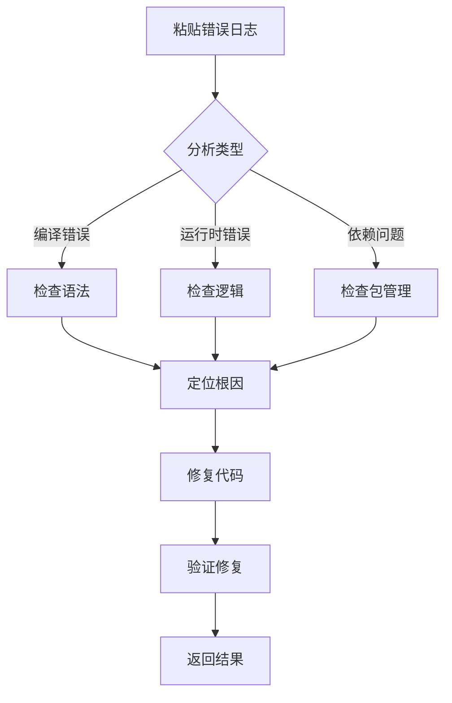
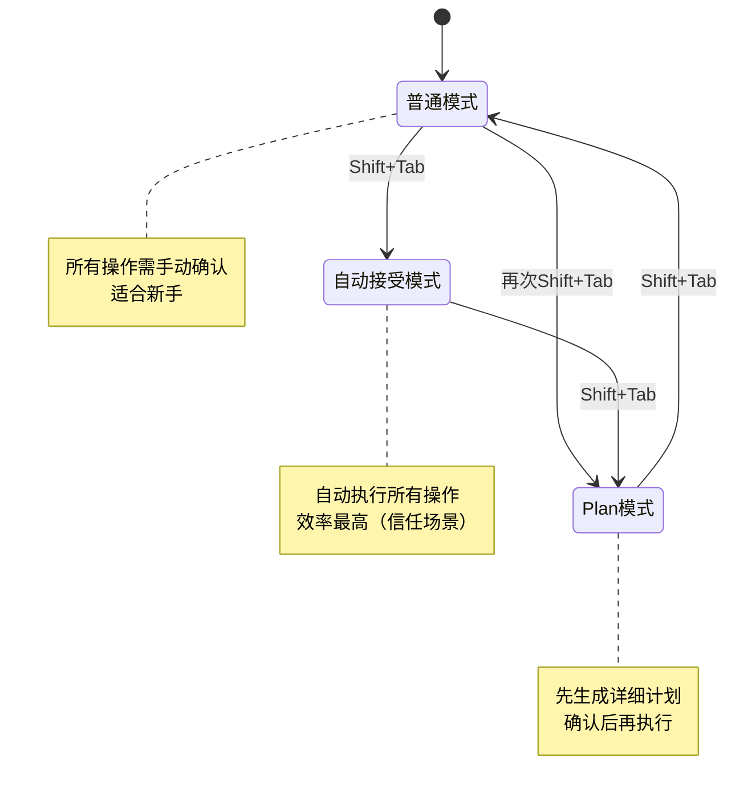

# VS Code Copilot 经验

> GitHub Copilot 使用相关经验
> 
> 包含：Chat、Agent、Custom Instructions、Skills、MCP 等

---

## VS Code Copilot 与 Claude Code 共享 Skills 仓库

**日期**：2026-01-30  
**标签**：#skills #claude-code #copilot #配置  
**状态**：✅ 已验证

**问题/场景**：

希望 VS Code Copilot 和 Claude Code 能够共享同一套 Skills 和经验记录系统，避免维护两套配置，实现统一管理。

**解决方案/结论**：

通过**符号链接**让两者共享同一个 Git 仓库中的 Skills 和配置文件。

**配置步骤**：

1. 确认目录结构：
   - VS Code Copilot Skills 目录：`~/.copilot/skills/`
   - Claude Code Skills 目录：`~/.claude/skills/`
   - Claude Code 全局指令：`~/.claude/CLAUDE.md`

2. 创建符号链接共享 Skills：
   ```bash
   mkdir -p ~/.claude/skills
   ln -sf ~/.copilot/skills/experience-logger ~/.claude/skills/experience-logger
   ```

3. 创建符号链接共享全局指令（可选）：
   ```bash
   ln -sf ~/.copilot/CLAUDE.md ~/.claude/CLAUDE.md
   ```

**最终目录结构**：

```
~/.copilot/  (Git 仓库)
├── CLAUDE.md                           # Claude Code 全局指令
├── skills/
│   └── experience-logger/SKILL.md      # 经验记录技能
└── experiences/                        # 经验数据

~/.claude/
├── CLAUDE.md -> ~/.copilot/CLAUDE.md   # 符号链接
├── skills/
│   └── experience-logger -> ~/.copilot/skills/experience-logger
└── settings.json                       # Claude Code 设置
```

**关键区别**：

| 特性 | VS Code Copilot | Claude Code |
|------|----------------|-------------|
| Skills 目录 | `~/.copilot/skills/` | `~/.claude/skills/` |
| 全局指令 | `.instructions.md` | `CLAUDE.md` |
| Skills 格式 | 相同（`SKILL.md`） | 相同（`SKILL.md`） |
| 验证命令 | 自动加载 | `/skills` 查看列表 |

**参考链接**：

- [Claude Code Skills 官方文档](https://code.claude.com/docs/en/skills) - 技能创建和配置指南
- [Claude Code Memory 官方文档](https://code.claude.com/docs/en/memory) - CLAUDE.md 配置说明

**验证记录**：

- [2026-01-30] 初次记录，来源：实践总结。配置完成后两边均可正常使用共享的经验记录技能。

**备注**：

- Claude Code 的 Skills 遵循 [Agent Skills](https://agentskills.io/) 开放标准
- 修改任何一边的配置后，另一边自动生效（因为是符号链接）
- Git 仓库只需在 `~/.copilot/` 维护一份即可

---

## Claude Code 完整指南

**日期**：2026-01-30
**标签**：#claude-code #ai-coding #终端 #开发工具
**状态**：✅ 已验证

**问题/场景**：

Claude Code 是什么？有哪些核心功能？与 VS Code Copilot 有什么区别？如何最大化发挥其价值？

**解决方案/结论**：

### 一、Claude Code 是什么？

Claude Code 是 Anthropic 推出的**终端原生 AI 编程助手**，直接在终端中运行，无需切换 IDE 或聊天窗口。


**核心定位**：项目级开发助手，而非文件级代码补全工具

### 二、核心优势

| 优势 | 说明 | 带来价值 |
|------|------|----------|
| **终端原生** | 直接在 CLI 中运行 | 无需切换窗口，工作流不中断 |
| **200k 超长上下文** | 比传统工具多 10 倍以上 | 理解整个大型项目 |
| **支持 40+ 语言** | 覆盖主流编程语言 | 适用于全栈开发 |
| **项目级视野** | 扫描整个代码库 | 全局理解架构和依赖 |
| **直接操作** | 可编辑文件、运行命令、创建提交 | 所想即所得，无需手动复制 |
| **MCP 扩展** | 可连接外部工具 | 无限扩展能力 |

### 三、与 VS Code Copilot 对比


| 特性 | VS Code Copilot | Claude Code |
|------|----------------|-------------|
| **定位** | 文件级代码补全 | 项目级开发助手 |
| **上下文** | 单文件为主 | 200k 超长上下文 |
| **核心功能** | 实时代码补全 | 全局规划、自动化、调试 |
| **适用场景** | 日常编码、局部逻辑 | 复杂项目、重构、文档 |
| **推荐用法** | 搭配使用效果最佳 | 搭配使用效果最佳 |

**结论**：两者不是替代关系，而是**互补关系**。建议同时使用：
- **VS Code Copilot**：负责实时代码补全
- **Claude Code**：负责整体方案和复杂任务

### 四、核心功能详解

#### 4.1 代码生成（自然语言转代码）

```
你：帮我用 React + TypeScript 写一个 TodoList 组件，要求支持添加、删除和状态切换，使用 Tailwind CSS 样式

Claude Code：
  1. 分析需求
  2. 规划方案
  3. 创建文件
  4. 编写代码
  5. 确保可运行
```

**支持场景**：
- 前端组件（React, Vue, Svelte 等）
- 后端接口（Spring Boot, Gin, Express 等）
- 数据脚本（SQL, Python 数据处理）
- 配置文件（Docker, Kubernetes 等）

#### 4.2 调试修复（一键解决问题）



**支持输入方式**：
- 文本错误日志
- 截图调试（macOS: `Ctrl+V`, Windows: `Alt+V`）

#### 4.3 代码库导航（全局理解项目）

```
你：分析 @src/services/api.ts 的接口设计
Claude Code：
  - 扫描文件
  - 分析接口结构
  - 总结设计模式
  - 提出优化建议

你：这个项目的权限认证逻辑是怎样的？
Claude Code：
  - 扫描认证相关文件
  - 追踪调用链
  - 绘制流程图
  - 解释安全机制
```

#### 4.4 自动化任务（解放重复劳动）

| 任务类型 | 示例命令 | 说明 |
|---------|----------|------|
| 修复 lint | `帮我批量修复项目中的所有 ESLint 错误` | 自动修复代码规范问题 |
| 解决冲突 | `处理当前分支的 Git 合并冲突` | 智能合并代码 |
| 生成文档 | `为 @src/utils/date.ts 写详细注释和使用示例` | 自动生成文档 |
| 运行测试 | `claude -p "检测新提交的代码，生成测试用例并运行"` | CI 集成 |
| 重构代码 | `重构 @src/components/Button 组件，提取通用逻辑` | 代码优化 |

### 五、进阶功能

#### 5.1 权限模式切换（`Shift + Tab`）



#### 5.2 高效交互技巧

| 技巧 | 用法 | 示例 |
|------|------|------|
| 文件提及 | `@文件路径` | `分析 @src/App.tsx 的结构` |
| Bash 模式 | `!命令` | `! git status` |
| 多行输入 | `\` + Enter 或 `Shift+Enter` | 输入复杂需求 |
| 快捷键 | `Ctrl+R` 搜索历史 | 快速查找之前的问题 |

#### 5.3 记忆管理（CLAUDE.md）

`CLAUDE.md` 是项目的"第二大脑"，记录项目架构、编码规范、数据库结构等信息。


**CLAUDE.md 内容示例**：

```markdown
# 项目规范

## 代码风格
- 使用 ESLint + Prettier
- 单引号，无分号
- 组件命名：PascalCase

## 架构说明
- 前端：React + TypeScript + Tailwind
- 后端：Node.js + Express
- 数据库：PostgreSQL

## 接口规范
- 所有请求统一使用 @src/services/request.ts
- 错误处理统一格式：{ code, message, data }
```

#### 5.4 自定义斜杠命令

在项目根目录创建 `.claude/commands/review.md`：

```markdown
# /review 命令逻辑
1. 检查最近修改的代码是否符合项目规范
2. 识别潜在性能问题和安全漏洞
3. 建议补充必要的测试用例
```

使用：输入 `/review` 即可执行自定义流程。

#### 5.5 MCP 扩展（连接外部工具）

```json
// ~/.config/claude/settings.json
{
  "mcp_servers": {
    "github": {
      "command": "npx",
      "args": ["-y", "@model-context-protocol/server-github"],
      "env": {
        "GITHUB_PERSONAL_ACCESS_TOKEN": "ghp_xxx"
      }
    }
  }
}
```

**常用 MCP 服务器**：
- GitHub：代码仓库操作
- Google Drive：文件管理
- Figma：设计协作
- Jira：项目管理

### 六、使用场景矩阵

| 场景 | Claude Code | VS Code Copilot | 推荐选择 |
|------|-------------|-----------------|----------|
| 新建项目骨架 | ✅ 擅长 | ⚠️ 较弱 | Claude Code |
| 重构代码 | ✅ 全局理解 | ⚠️ 单文件 | Claude Code |
| 修复 bug | ✅ 上下文丰富 | ⚠️ 需复制 | Claude Code |
| 实时代码补全 | ⚠️ 需手动 | ✅ 实时 | Copilot |
| 快速生成函数 | ⚠️ 需切换 | ✅ 就在 IDE | Copilot |
| 处理 Git 冲突 | ✅ 直接操作 | ❌ 不支持 | Claude Code |
| 生成文档 | ✅ 理解项目 | ⚠️ 局部理解 | Claude Code |
| 学习新框架 | ✅ 项目级讲解 | ⚠️ 片段式 | Claude Code |

### 七、安装与配置

#### 7.1 安装

```bash
# macOS / Linux / WSL
curl -fsSL https://claude.ai/install.sh | bash

# Windows PowerShell
irm https://claude.ai/install.ps1 | iex

# 验证安装
claude --version
```

#### 7.2 首次认证

```bash
cd your-project
claude
# 按提示在浏览器中完成 OAuth 授权
```

### 八、最佳实践

1. **善用 CLAUDE.md**：记录项目规范，避免重复解释
2. **先 Plan 再执行**：复杂任务先切换到 Plan 模式
3. **合理使用权限模式**：信任场景用自动接受，新手用普通模式
4. **定期压缩上下文**：大型项目用 `/compact` 节省 token
5. **配置 .claudeignore**：排除 `node_modules/` 等不必要的目录
6. **结合 VS Code Copilot**：实时补全 + 项目级规划 = 最佳组合

### 九、常见问题

| 问题 | 解决方案 |
|------|---------|
| 命令未找到 | 检查环境变量，将 npm 全局路径添加到 PATH |
| 认证失败 | 运行 `/logout` 退出登录，重新授权 |
| 权限被拒 | 运行 `/permissions` 配置信任路径 |
| 性能慢 | 使用 `/compact` 压缩上下文，配置 `.claudeignore` |

**参考链接**：

- [Claude Code 官方文档](https://code.claude.com/docs/en)
- [Claude Code Skills 官方文档](https://code.claude.com/docs/en/skills)
- [MCP 官方规范](https://modelcontextprotocol.io/)
- [阿里云全攻略文章](https://developer.aliyun.com/article/1705912)

**验证记录**：

- [2026-01-30] 初次记录，来源：[阿里云全攻略](https://developer.aliyun.com/article/1705912)、官方文档整合

---