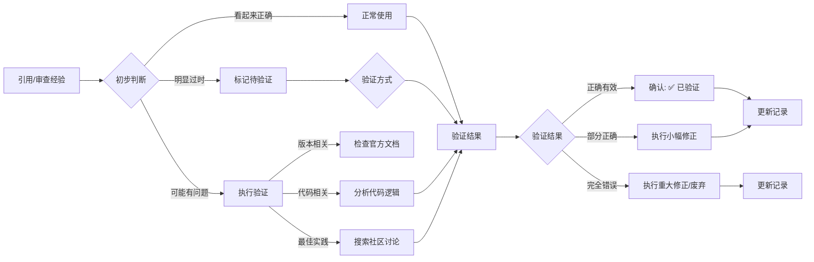
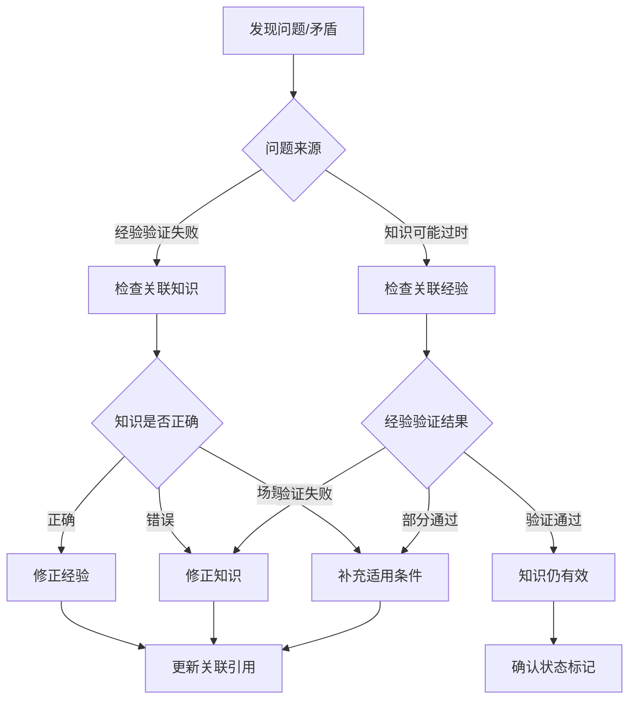

# 验证与修正流程

> 记录系统（经验 + 知识）的验证与修正操作指南

---

## 一、验证类型

### 经验验证

| 验证类型 | 说明 |
|---------|------|
| **正确性验证** | 确认经验是否仍然有效和适用 |
| **时效性验证** | 检查版本和环境变化是否影响经验 |
| **逻辑验证** | 分析经验的推理过程是否正确 |

### 知识验证

| 验证类型 | 说明 |
|---------|------|
| **来源验证** | 确认知识来源是否权威、是否有更新版本 |
| **准确性验证** | 核对定义、原理是否与官方文档一致 |
| **实践验证** | 通过相关经验检验知识的实际适用性 |

---

## 二、验证流程

### 触发时机



---

## 三、修正策略

### 小幅修正

**定义**：内容基本正确，需要补充或微调

```markdown
**验证记录**：
- [2024-01-29] 修正：原方案在 Unity 2022+ 需要额外配置 xxx，已补充说明
```

### 重大修正

**定义**：核心方案有误或有更好替代方案

```markdown
**解决方案/结论**：

**[当前推荐方案]**
[新的正确方案内容]

<details>
<summary>📜 历史方案（已废弃）</summary>

**原方案**（适用于 Unity 2020 及之前版本）：
[原有内容]

**废弃原因**：Unity 2021 后 API 变更，原方法已被标记为 Obsolete
</details>
```

---

## 四、废弃流程

### 触发条件

- 经验证发现的错误经验
- 有更好的替代方案
- 技术框架/库已停止维护

### 废弃标记

在标题后添加 `[已废弃]` 标记。

### 废弃警告格式

```markdown
> ⚠️ **此经验已废弃**
> 废弃原因：[具体原因]
> 替代方案：参见 [新经验标题](#链接) 或 [官方文档](URL)
```

---

## 五、状态标记说明

### 经验状态标记

| 标记 | 含义 | 使用场景 |
|------|------|----------|
| ✅ 已验证 | 经过实践验证，确认有效 | 已经过实践检验的经验 |
| ⚠️ 待验证 | 理论可行但未经实际验证 | 新记录或来自网络搜索的内容 |
| 🔄 已过时 | 方案已过时，保留供参考 | 老版本适用的方案 |
| ❌ 已废弃 | 完全错误，不应使用 | 经验证发现的错误经验 |
| 🔬 实验性 | 非主流方案，使用需谨慎 | 创新但未广泛验证的方法 |

### 知识状态标记

| 标记 | 含义 | 使用场景 |
|------|------|----------|
| 📘 有效 | 知识准确且适用于当前版本 | 经核实的权威知识 |
| 🔄 待更新 | 来源有新版本，需更新内容 | 官方文档已更新 |
| 📕 已过时 | 知识已不适用于当前技术环境 | API 废弃、规范变更 |

---

## 六、知识验证流程

### 触发时机

| 场景 | 说明 |
|------|------|
| **引用知识时** | 将知识应用于实际问题时，检查是否仍然适用 |
| **来源更新时** | 官方文档、规范有新版本发布 |
| **经验反馈时** | 相关经验验证结果与知识描述不符 |
| **定期审查时** | 周期性检查高频使用的知识条目 |

### 验证方法

#### 来源验证

1. **检查官方文档**：确认原始来源是否有更新
2. **核对版本号**：对比知识记录的版本与当前最新版本
3. **查阅变更日志**：检查 Breaking Changes 或 Deprecation

#### 交叉验证（知识 ↔ 经验）

1. **经验验证知识**：
   - 查找应用此知识的相关经验
   - 检查经验的验证状态
   - 如果经验标记为 ❌ 已废弃，审查对应知识

2. **知识指导经验**：
   - 新记录经验时，查找相关知识作为理论基础
   - 如果经验与知识矛盾，优先验证知识来源

### 修正策略

| 验证结果 | 处理方式 |
|----------|----------|
| **来源已更新** | 更新知识内容，标注新版本信息 |
| **部分过时** | 补充版本适用范围，保留历史内容 |
| **完全过时** | 标记为 📕 已过时，添加替代知识链接 |

### 知识废弃格式

```markdown
> 📕 **此知识已过时**
> 过时原因：[API 废弃/规范变更/技术淘汰]
> 适用版本：[原适用版本范围]
> 替代知识：参见 [新知识点](#链接)
```

---

## 七、交叉验证指南

### 何时建立关联

| 场景 | 操作 |
|------|------|
| **记录经验时** | 查找相关知识，添加"理论基础"引用 |
| **记录知识时** | 查找实践验证，添加"与经验关联"引用 |
| **验证失败时** | 检查关联的另一方是否也需要修正 |
| **发现矛盾时** | 双向验证，确定哪方需要修正 |

### 关联的作用

```
知识（理论）                经验（实践）
     │                         │
     │   ┌─────────────────┐   │
     └──►│  交叉验证       │◄──┘
         │  - 知识指导实践  │
         │  - 实践验证理论  │
         └─────────────────┘
```

### 交叉验证流程



### 关联引用格式

**在经验中引用知识**：
```markdown
**理论基础**：
- [SRP Batcher 原理](../knowledge/unity/urp.md#srp-batcher) - 解释了为什么需要 CBUFFER 统一
```

**在知识中引用经验**：
```markdown
### 与经验关联
- 实践验证：[CBUFFER 合批经验](../experiences/shader/urp.md#cbuffer-合批) - 验证了 CBUFFER 命名规范的必要性
- 实践验证：[SRP Batcher 调试](../experiences/unity/performance.md#srp-batcher-debug) - 提供了问题排查方法
```

---

## 八、冲突处理

### 冲突检测

当新记录的经验与已有经验存在矛盾时：

1. **检测冲突**：
   - 在记录前搜索相关主题的已有经验
   - 比较核心结论是否一致
   - 识别可能的版本差异或场景差异

2. **处理策略**：

| 冲突类型 | 处理方式 |
|-----------|----------|
| **场景不同** | 两条经验都保留，明确标注各自适用场景 |
| **版本差异** | 标注版本适用范围，新版本方案作为推荐 |
| **真正冲突** | 验证后保留正确的，修正或废弃错误的 |

### 关联引用

```markdown
相关经验：
- [Unity 协程优化](unity/csharp.md#coroutine-optimization)
- [async/await 替代方案](csharp/async.md#async-as-alternative)
```

### 适用条件说明

在相互引用的经验中添加各自的适用条件：

```markdown
**Unity 协程优化**（yield return null）：
- 适用：Unity 2021+
- 注意：2020 及之前版本使用 yield return 0 会有问题

**async/await 替代方案**：
- 适用：不依赖 Unity 主线程的计算、网络请求等
- 注意：协程在等待帧、物理更新等场景仍然适用
```

---

## 九、最佳实践

### 记录时验证

1. **代码验证**：如果用户提供代码示例，建议在真实环境测试后再记录
2. **版本说明**：明确标注适用的技术版本范围
3. **场景限定**：说明经验适用的特定使用场景
4. **风险提示**：对于实验性或边缘场景，添加风险警告

### 引用规范

```markdown
**官方文档优先**：优先引用官方文档，标注版本和日期
**社区资料次之**：Stack Overflow、技术博客等作为补充参考
**标注日期**：在参考链接前注明发布或更新日期
```

### 标签使用

推荐使用以下标签组合：

- `#标签名` - 主要分类标签
- `#version` - 版本相关（如 `#unity2021+`）
- `#env` - 环境相关（如 `#vscode`、`#terminal`）
- `#status` - 状态相关（如 `#deprecated`）

---

## 十、经验质量保证

### 质量检查清单

记录新经验前自查：

- [ ] 内容是否清晰易懂？
- [ ] 是否提供了可执行的解决方案？
- [ ] 代码示例是否准确可运行？
- [ ] 参考链接是否有效且相关？
- [ ] 是否标注了适用的版本范围？
- [ ] 标签是否准确反映内容类型？

### 持续改进

- 定期审查和更新过时经验
- 收集用户反馈，修正错误的记录
- 按照技术发展更新最佳实践
