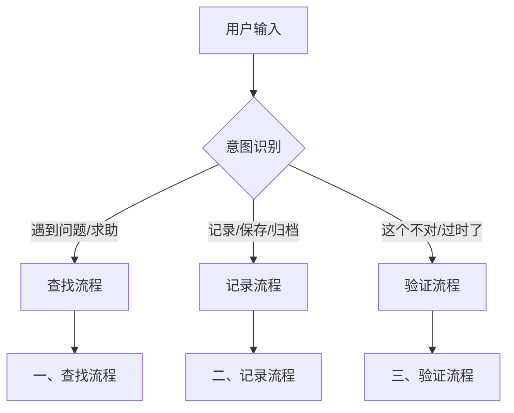
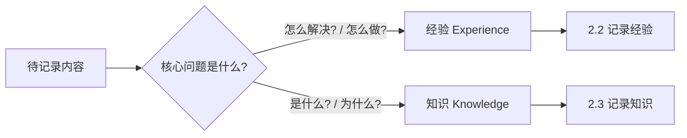
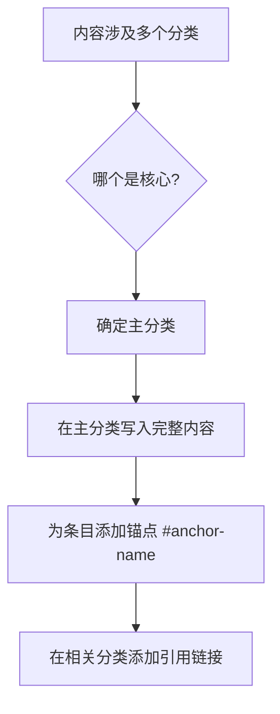

# 操作流程详解

> 记录系统的详细操作步骤和工作流程（经验 + 知识）

---

## 总入口：意图识别

当用户输入时，首先进行意图识别，决定进入哪个流程分支：



### 意图关键词

| 意图 | 触发词示例 | 进入流程 |
|------|-----------|----------|
| **求助/提问** | "怎么解决"、"为什么"、"如何实现"、"有没有办法" | 一、查找流程 |
| **记录请求** | "记录一下"、"保存结论"、"归档"、"记一下这个知识点" | 二、记录流程 |
| **验证/修正** | "这个不对"、"过时了"、"有问题"、"需要更新" | 三、验证流程 |

---

## 一、查找流程

> 用户遇到问题时，优先从已有记录中检索

### 步骤

1. **判断问题领域**：确定应该检索哪个分类目录
2. **读取相关文件**：读取对应分类的 md 文件内容
3. **搜索匹配记录**：根据关键词、标签查找相关经验/知识
4. **呈现给用户**：
   - 如果找到相关记录，展示内容并询问是否适用
   - 如果未找到，**转入"1.2 网络搜索"**

### 搜索技巧

- 使用关键词匹配：如"协程"、"yield"、"DOTS"
- 查看标签过滤：根据场景快速筛选
- 检查状态标记：优先使用 ✅ 已验证的内容

### 1.2 网络搜索（记录未找到时）

**步骤**：

1. **告知用户**："未在记录中找到相关内容，正在上网搜索..."
2. **构建搜索关键词**：根据问题提取核心关键词
3. **执行网络搜索**：使用 `#fetch` 工具搜索相关资料
4. **优先搜索来源**（按优先级）：
   - 官方文档（Unity Docs、Microsoft Docs、MDN 等）
   - 官方论坛/讨论区
   - Stack Overflow
   - 知名技术博客
5. **整理搜索结果**：提取关键信息、记录参考链接、标注时效性
6. **呈现给用户**：展示搜索到的解决方案
7. **询问是否记录**：如果解决了问题，询问是否记录 → 进入 **二、记录流程**

---

## 二、记录流程

> 将有价值的内容保存到对应分类文件

### 2.1 判断内容类型



| 判断依据 | 记录为经验 | 记录为知识 |
|----------|-----------|-----------|
| 核心问题 | "怎么解决/怎么做" | "是什么/为什么" |
| 内容特点 | 问题 → 方案 → 验证 | 定义 → 原理 → 要点 |
| 存放位置 | `data/experiences/` | `data/knowledge/` |
| 触发词 | "记录一下"、"总结经验" | "记一下这个知识点"、"概念记录下来" |

### 2.1.1 跨分类内容处理

当内容涉及多个领域时，**不要重复记录**，而是采用交叉引用：



**判断主分类的标准**：
| 判断维度 | 说明 | 示例 |
|----------|------|------|
| 问题发生层 | 问题实际出现在哪个层面 | BD 插件中的 Tooltip 冲突 → 主分类是 Unity 编辑器 |
| 解决方案层 | 解决方案属于哪个技术栈 | 用 Unity API 解决 BD 问题 → 主分类是 Unity |
| 通用性 | 该知识/经验是否可复用到其他场景 | 命名空间冲突是通用 C# 问题 → 可能归入 C# 分类 |

**交叉引用格式**：
```markdown
# 在相关分类文件中添加
> 另见：[相关条目标题](../../主分类/文件.md#anchor-name) —— 一句话说明相关性
```

**常见多分类场景**：
- Unity 插件问题 → 主：`experiences/unity/editor.md` / 引用：`knowledge/unity/<插件>.md`
- 语言特性在框架中的应用 → 主：框架分类 / 引用：语言分类
- 工具配合使用 → 主：核心工具 / 引用：辅助工具

### 2.2 记录经验

**步骤**：

1. **同步仓库**：`git pull origin main`
2. **确定分类**：根据内容主题选择对应的分类文件
3. **检查重复**：查看目标文件中是否已有类似记录
   - 如有类似 → 转入 **三、验证流程** 进行更新
   - 如无类似 → 继续新增
4. **提取要点**：
   - 简短标题（一句话概括）
   - 问题/场景描述
   - 解决方案/结论
   - 关键代码片段（如有）
   - 相关标签
   - 参考链接
5. **格式化内容**：按照经验模板格式化
6. **追加写入**：将内容追加到对应分类文件末尾
7. **推送更改**：`git add . && git commit -m "docs: add experience [标题]" && git push`
8. **确认反馈**：告知用户已记录到哪个文件

**经验分类选择指南**：

| 问题类型 | 推荐分类 |
|---------|----------|
| Unity C# 脚本 | `experiences/unity/csharp.md` |
| Unity Shader | `experiences/unity/shader.md` |
| C# 语法/异步/LINQ | `experiences/csharp/*.md` |
| Git 操作 | `experiences/git/commands.md` |
| VS Code/Copilot | `experiences/vscode/*.md` |

### 2.3 记录知识

**步骤**：

1. **同步仓库**：`git pull origin main`
2. **确定分类**：判断属于哪个分类（AI/图形学/Unity/编程/HLSL/工具等）
3. **检查重复**：避免重复记录相同知识点
4. **提取要点**：
   - 简短标题（知识点名称）
   - 分类和关键词
   - 来源信息（书籍/文档/课程等）
   - 定义/概念
   - 原理/详解
   - 关键点
   - 示例（如有）
5. **格式化内容**：按照知识模板格式化
6. **追加写入**：将内容追加到目标文件末尾
7. **推送更改**：`git add . && git commit -m "docs: add knowledge [标题]" && git push`
8. **确认反馈**：告知用户已记录到哪个文件

**知识分类选择指南**：

| 知识类型 | 推荐分类 |
|---------|----------|
| AI Agent 规范 | `knowledge/ai/agent-skills.md` |
| 渲染管线、光照理论 | `knowledge/graphics/*.md` |
| URP/SRP 原理 | `knowledge/unity/urp.md` |
| C# 语言特性 | `knowledge/programming/csharp.md` |
| HLSL 语法 | `knowledge/hlsl/syntax.md` |

---

## 三、验证流程

> 验证已有记录的正确性，必要时进行修正

### 3.1 触发验证的场景

| 场景 | 说明 |
|------|------|
| **引用时验证** | 当引用某条记录回答用户问题时，判断其是否仍然适用 |
| **用户反馈** | 用户表示"这个方法不行"、"不对"、"有问题"、"过时了" |
| **版本更新** | 讨论中发现相关技术/框架有重大版本更新 |
| **矛盾检测** | 新记录与已有记录产生冲突 |

### 3.2 验证方法

1. **上下文对比**：检查记录日期和适用版本，对比用户当前技术栈
2. **官方文档验证**：查阅官方文档，检查 Breaking Changes 或 Deprecation
3. **交叉验证**：知识与经验相互验证（详见 VALIDATION.md）

### 3.3 修正策略

| 验证结果 | 处理方式 |
|----------|----------|
| **正确有效** | 确认状态标记，结束 |
| **部分正确** | 补充适用条件说明 |
| **明显过时** | 标记为 🔄 已过时 |
| **完全错误** | 标记为 ❌ 已废弃，添加正确方案 |

### 3.4 更新记录

**步骤**：

1. **定位记录**：找到需要更新的条目
2. **执行更新**：
   - 更新"更新日期"字段
   - 在"验证记录"中添加本次说明
3. **推送更改**：`git add . && git commit -m "fix: update [文件名]" && git push`
4. **反馈用户**：说明更新了什么内容

---

## 四、辅助流程

### 4.1 大型内容处理

> 当内容非常丰富（如完整的设计文档、架构图解）时，采用"摘要 + 独立文档"的策略。

**触发条件**：
- 内容长度超过 50 行
- 包含大量图表/代码
- 属于完整技术方案
- 用户明确要求保存为独立文档

**处理流程**：

1. **创建独立文档**：路径 `[分类]/docs/[英文_下划线_命名].md`
2. **编写摘要记录**：在主分类文件中添加标准记录 + 详细文档链接
3. **填充独立文档**：包含完整细节、代码和图表

### 4.2 仓库同步流程

> 💡 **路径说明**：以下命令在技能目录（SKILL.md 所在目录）中执行。
> Agent 可通过读取 SKILL.md 时获取的文件路径推断技能目录位置。

**拉取最新**（搜索/记录前执行）：
```bash
cd <skill-dir>  # 技能目录，即 SKILL.md 所在目录
git pull origin main
```

**提交推送**（记录/更新后执行）：
```bash
cd <skill-dir>  # 技能目录
git add .
git commit -m "docs: [操作类型] [简短描述]"
git push origin main
```

**Commit 信息规范**：
- 新增经验：`docs: add experience [标题]`
- 新增知识：`docs: add knowledge [标题]`
- 更新已有：`docs: update [文件名] - [修改内容]`
- 修正错误：`fix: correct [文件名] - [错误描述]`

**冲突解决**：
```bash
git pull --rebase origin main
# 解决冲突后
git add . && git rebase --continue
git push origin main
```

### 4.3 相互引用

**在经验中引用知识**：
```markdown
**理论基础**：
- 参考知识：[相关知识点](../knowledge/分类/文件.md#锚点)
```

**在知识中引用经验**：
```markdown
### 与经验关联
- 实践验证：[相关经验标题](../experiences/分类/文件.md#锚点)
```
