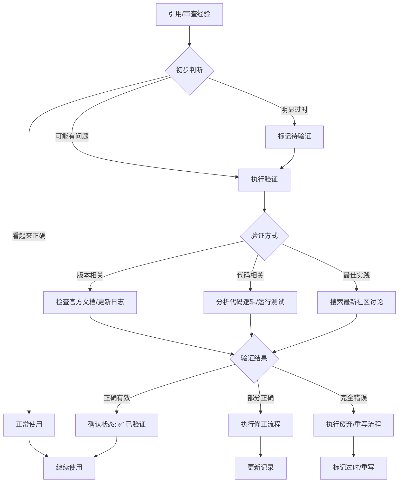

# 经验记录 Skill

## 核心功能

1. **记录经验**：将问题解决方案和结论保存到对应分类文件
2. **查找经验**：遇到问题时优先从已有经验中检索相关内容
3. **网络搜索**：已有经验未找到时，上网搜索相关资料
4. **动态更新**：验证、补充、修正已有经验记录

## 何时使用

### 触发记录
- 成功解决了一个技术问题
- 讨论某个话题得出了有价值的结论
- 用户明确要求记录/保存/归档当前内容

### 触发查找
- 用户遇到技术问题时，**优先检索** `~/.copilot/experiences/` 目录
- 用户说"之前是怎么解决的"、"有没有相关经验"、"查一下记录"

### 触发网络搜索
- 已有经验中**未找到**相关内容
- 需要获取最新的官方文档或解决方案
- 用户明确要求"上网查一下"、"搜索一下"

### 触发更新
- 发现已有记录需要补充新信息
- 已有记录的方案有更好的替代方案
- 需要添加新的参考链接或验证结果

### 触发验证与修正
- 用户反馈"这个方法不行"、"不对"、"有问题"、"过时了"
- 引用经验时发现版本/环境不匹配
- 新记录的经验与已有经验产生冲突
- 用户要求"检查/审查/验证这个经验"

## 记录存放位置

所有经验记录统一存放在：`~/.copilot/experiences/`

采用**大类文件夹 + 细分文件**的二级结构。

## 分类体系

### unity/ - Unity 引擎

| 文件 | 适用内容 |
|------|---------|
| `csharp.md` | Unity C# 脚本：MonoBehaviour、协程、事件、ScriptableObject |
| `physics.md` | 物理系统：Rigidbody、Collider、碰撞检测、射线、关节 |
| `shader.md` | Unity Shader：ShaderLab、Shader Graph、材质 |
| `vfx.md` | 特效技法：粒子系统、VFX Graph、后处理 |
| `ui.md` | UI 系统：UGUI、UI Toolkit、Canvas 优化 |
| `animation.md` | 动画系统：Animator、状态机、IK、Timeline |
| `performance.md` | 性能优化：内存、GC、Draw Call、批处理、Profiler |
| `editor.md` | 编辑器扩展：Inspector、EditorWindow、工具开发 |
| `networking.md` | 网络开发：Netcode、Mirror、同步 |
| `asset.md` | 资源管理：AssetBundle、Addressables、热更新 |
| `misc.md` | 其他 Unity 相关 |

### csharp/ - C# 语言

| 文件 | 适用内容 |
|------|---------|
| `syntax.md` | 语法特性：泛型、委托、事件、特性、反射 |
| `async.md` | 异步编程：async/await、Task、并发控制 |
| `linq.md` | LINQ 查询：表达式、方法语法、性能 |
| `patterns.md` | 设计模式：单例、工厂、观察者、SOLID |
| `collections.md` | 集合数据结构：List、Dictionary、Span |
| `dotnet.md` | .NET API：IO、网络、JSON、正则 |
| `misc.md` | 其他 C# 相关 |

### shader/ - Shader 开发

| 文件 | 适用内容 |
|------|---------|
| `hlsl.md` | HLSL 语法：数据类型、函数、语义 |
| `urp.md` | URP 管线：URP Shader、渲染特性 |
| `hdrp.md` | HDRP 管线：光照、体积效果 |
| `techniques.md` | 渲染技术：光照模型、阴影、PBR |
| `optimization.md` | 性能优化：指令、采样、变体 |
| `effects.md` | 特效实现：溶解、描边、扭曲、水面 |
| `misc.md` | 其他 Shader 相关 |

### git/ - 版本控制

| 文件 | 适用内容 |
|------|---------|
| `commands.md` | 常用命令：基础、高级、组合技巧 |
| `workflow.md` | 工作流：分支策略、PR、代码审查 |
| `troubleshooting.md` | 问题解决：冲突、回滚、恢复 |
| `lfs.md` | LFS 大文件：配置、迁移 |
| `misc.md` | 其他 Git 相关 |

### vscode/ - VS Code

| 文件 | 适用内容 |
|------|---------|
| `shortcuts.md` | 快捷键：常用、自定义、多光标 |
| `extensions.md` | 扩展：推荐、配置、开发 |
| `settings.md` | 配置：settings.json、工作区 |
| `copilot.md` | Copilot：Chat、Agent、Skills、MCP |
| `debugging.md` | 调试：launch.json、断点 |
| `misc.md` | 其他 VS Code 相关 |

### python/ - Python

| 文件 | 适用内容 |
|------|---------|
| `syntax.md` | 语法：类型提示、装饰器、上下文 |
| `libraries.md` | 常用库：requests、pandas、numpy |
| `automation.md` | 自动化：文件处理、批量操作 |
| `environment.md` | 环境管理：venv、conda、pip |
| `misc.md` | 其他 Python 相关 |

### tools/ - 开发工具

| 文件 | 适用内容 |
|------|---------|
| `terminal.md` | 终端命令：Shell、脚本、别名 |
| `build.md` | 构建工具：npm、webpack、vite |
| `debug.md` | 调试工具：日志、性能、内存分析 |
| `cicd.md` | CI/CD：GitHub Actions、自动化 |
| `misc.md` | 其他工具相关 |

### general/ - 通用

| 文件 | 适用内容 |
|------|---------|
| `misc.md` | 无法归类的其他有价值内容 |

## 记录格式

每条记录使用以下格式追加到对应文件：

```markdown
---

## [简短标题]

**日期**：YYYY-MM-DD  
**更新**：YYYY-MM-DD（如有更新）  
**标签**：#标签1 #标签2  
**状态**：✅ 已验证 | ⚠️ 待验证 | 🔄 已过时 | ❌ 已废弃 | 🔬 实验性  
**适用版本**：[技术名称] X.X+（如适用）

**问题/场景**：

[描述遇到的问题或讨论的场景]

**解决方案/结论**：

[详细的解决方案或得出的结论]

**关键代码**（如有）：

\`\`\`语言
// 相关代码片段
\`\`\`

**参考链接**：

- [官方文档](URL) - 简要说明
- [相关文章](URL) - 简要说明

**验证记录**：

- [YYYY-MM-DD] 初次记录，来源：[实践总结/网络搜索/用户反馈]
- [YYYY-MM-DD] 验证通过/发现问题，补充说明

**相关经验**（如有）：

- [相关经验标题](./path-to-file.md#anchor) - 关联说明

**备注**：

[其他补充说明]
```

## 操作步骤

### 一、查找已有经验（优先执行）

当用户遇到问题时，**首先**执行以下步骤：

1. **判断问题领域**：确定应该检索哪个分类目录
2. **读取相关文件**：读取对应分类的 md 文件内容
3. **搜索匹配记录**：根据关键词、标签查找相关经验
4. **呈现给用户**：
   - 如果找到相关记录，展示内容并询问是否适用
   - 如果未找到，**转入"网络搜索"步骤**
5. **验证有效性**：根据当前情况判断记录是否仍然有效

### 二、网络搜索（经验未找到时）

当已有经验中**未找到相关内容**时，执行以下步骤：

1. **告知用户**："未在经验记录中找到相关内容，正在上网搜索..."
2. **构建搜索关键词**：根据问题提取核心关键词
3. **执行网络搜索**：使用 `#fetch` 工具搜索相关资料
4. **优先搜索来源**（按优先级）：
   - 官方文档（Unity Docs、Microsoft Docs、MDN 等）
   - 官方论坛/讨论区
   - Stack Overflow
   - 知名技术博客
5. **整理搜索结果**：
   - 提取关键信息和解决方案
   - 记录参考链接来源
   - 标注信息的时效性（发布日期/版本）
6. **呈现给用户**：展示搜索到的解决方案
7. **询问是否记录**：如果解决了问题，询问是否将此经验记录下来

### 三、记录新经验

1. **同步仓库**：执行"仓库同步流程"中的"拉取最新"步骤
2. **识别内容**：判断当前对话中是否有值得记录的经验或结论
3. **确定分类**：根据内容主题选择对应的分类文件
4. **检查重复**：查看目标文件中是否已有类似记录
   - 如有类似记录，转为"更新"操作
   - 如无类似记录，执行"新增"操作
5. **提取要点**：
   - 简短标题（一句话概括）
   - 问题/场景描述
   - 解决方案/结论
   - 关键代码片段（如有）
   - 相关标签
   - **参考链接**（尽量提供官方文档或可信来源）
6. **格式化内容**：按照上述模板格式化
7. **追加写入**：将内容追加到对应分类文件末尾
8. **推送更改**：执行"仓库同步流程"中的"提交推送"步骤
9. **确认反馈**：告知用户已记录到哪个文件，并确认已同步到远程仓库

### 四、更新已有经验

当发现已有记录需要更新时：

1. **同步仓库**：执行"仓库同步流程"中的"拉取最新"步骤
2. **定位记录**：找到需要更新的经验条目
3. **判断更新类型**：
   - **补充**：添加新的信息、代码示例、参考链接
   - **修正**：纠正错误或过时的内容
   - **标记过时**：将状态改为 🔄 已过时，并说明原因
4. **执行更新**：
   - 更新"更新日期"字段
   - 在"验证记录"中添加本次验证/更新说明
   - 修改相应内容
5. **推送更改**：执行"仓库同步流程"中的"提交推送"步骤
6. **反馈用户**：说明更新了什么内容，并确认已同步到远程仓库

### 五、经验验证与修正

对已记录的经验进行正确性判断和修正，确保知识库的准确性和时效性。

#### 触发验证的场景

| 场景 | 说明 |
|------|------|
| **引用时验证** | 当引用某条经验回答用户问题时，根据当前上下文判断其是否仍然适用 |
| **用户反馈** | 用户表示"这个方法不行"、"不对"、"有问题"、"这个过时了" |
| **版本更新** | 讨论中发现相关技术/框架有重大版本更新 |
| **矛盾检测** | 新记录的经验与已有经验存在冲突 |
| **定期审查** | 用户明确要求"检查一下XX相关的经验"、"审查知识库" |

#### 判断经验正确性的流程



#### 验证方法

1. **上下文对比验证**
   - 检查经验记录的日期和适用版本
   - 对比用户当前使用的技术栈版本
   - 判断核心 API 或方法是否仍然存在

2. **官方文档验证**
   - 查阅相关技术的官方文档
   - 检查是否有 Breaking Changes 或 Deprecation 警告
   - 确认推荐的最佳实践是否改变

3. **实践验证**
   - 如果用户提供了具体错误信息，分析原因
   - 根据错误信息判断是经验本身的问题还是使用场景不同
   - 必要时建议用户进行简单测试验证

4. **社区验证**
   - 搜索相关技术的最新讨论
   - 检查是否有更优的替代方案
   - 了解常见的踩坑点和注意事项

#### 修正流程

根据验证结果，采取不同的修正策略：

##### 1. 小幅修正（内容基本正确，需要补充或微调）

```markdown
**操作步骤**：
1. 保留原有内容结构
2. 在需要修正的部分添加更正说明
3. 更新"更新日期"字段
4. 在"验证记录"中添加修正说明
5. 状态改为 ✅ 已验证

**示例**：
验证记录：
- [2024-01-29] 修正：原方案在 Unity 2022+ 需要额外配置 xxx，已补充说明
```

##### 2. 重大修正（核心方案有误或有更好替代）

```markdown
**操作步骤**：
1. 将原方案内容移至"历史记录"部分（不删除，保留参考）
2. 在正文添加新的正确方案
3. 明确标注新旧方案的区别和适用场景
4. 更新状态为 ✅ 已验证
5. 在"验证记录"中详细说明修正原因

**格式示例**：
---
**解决方案/结论**：

**[当前推荐方案]**
[新的正确方案内容]

<details>
<summary>📜 历史方案（已废弃）</summary>

**原方案**（适用于 Unity 2020 及之前版本）：
[原有内容]

**废弃原因**：Unity 2021 后 API 变更，原方法已被标记为 Obsolete

</details>
```

##### 3. 完全废弃（经验完全错误或已无参考价值）

```markdown
**操作步骤**：
1. 状态改为 🔄 已过时 或 ❌ 已废弃
2. 在标题后添加 [已废弃] 标记
3. 在开头添加醒目的废弃警告
4. 说明废弃原因和替代方案（如有）
5. 保留内容不删除，以供历史参考
6. 在"验证记录"中记录废弃决定

**格式示例**：
---
## [标题] [已废弃]

> ⚠️ **此经验已废弃**  
> 废弃原因：[具体原因]  
> 替代方案：参见 [新经验标题](#链接) 或 [官方文档](URL)
```

#### 用户反馈处理

当用户表示经验有问题时的处理流程：

1. **收集信息**：
   - 询问具体出了什么问题（错误信息、异常行为等）
   - 确认用户的技术环境（版本、平台等）
   - 了解用户的具体使用场景

2. **分析问题**：
   - 判断是经验本身错误还是场景不适用
   - 检查是否是版本差异导致的问题
   - 确认是否有遗漏的前置条件

3. **采取行动**：
   - 如果经验有误：执行相应的修正流程
   - 如果场景不适用：补充适用条件说明
   - 如果是版本问题：添加版本兼容性说明

4. **反馈确认**：
   - 告知用户分析结果和处理方式
   - 提供正确的解决方案
   - 询问是否解决了用户的问题

#### 经验质量标记

为了更好地管理经验的可信度，使用以下扩展标记：

| 标记 | 含义 | 使用场景 |
|------|------|---------|
| ✅ 已验证 | 经过实际验证，确认有效 | 经过实践检验的经验 |
| ⚠️ 待验证 | 理论可行但未经实际验证 | 新记录或来自网络搜索的内容 |
| 🔄 已过时 | 方案已过时，但保留供参考 | 老版本适用的方案 |
| ❌ 已废弃 | 完全错误，不应使用 | 经验证发现的错误经验 |
| 🔬 实验性 | 非主流方案，使用需谨慎 | 创新但未广泛验证的方法 |

#### 冲突检测与处理

当新记录的经验与已有经验存在矛盾时：

1. **检测冲突**：
   - 在记录前搜索相关主题的已有经验
   - 比较核心结论是否一致
   - 识别可能的版本差异或场景差异

2. **处理策略**：
   - **场景不同**：两条经验都保留，明确标注各自适用场景
   - **版本差异**：标注版本适用范围，新版本方案作为推荐
   - **真正冲突**：验证后保留正确的，修正或废弃错误的

3. **关联处理**：
   - 在相关经验间添加互相引用链接
   - 说明不同方案的适用条件
   - 帮助后续查找时快速判断

### 六、处理大型内容 (Large Content Handling)

当经验内容非常丰富（如完整的设计文档、架构图解、长篇复盘）时，**不应**直接全部堆积在汇总文件中，而应采用**摘要 + 独立文档**的策略。

#### 触发条件
- 内容长度超过 50 行
- 包含大量图表代码（如 Mermaid 流程图）
- 属于完整的技术方案、API 文档或架构设计
- 用户明确要求保存为独立文档

#### 处理流程
1. **同步仓库**：执行"仓库同步流程"中的"拉取最新"步骤
2. **创建独立文档**：
   - 命名规范：`[分类]/docs/[英文_下划线_命名].md`
   - 例如：`unity/docs/VR_Variant_Collector_Architecture.md`
   - 内容：包含完整的所有细节、代码和图表
3. **编写摘要记录**：
   - 在主分类文件（如 `unity/shader.md`）中添加一条标准记录
   - 内容：仅保留背景、核心结论和关键点
   - **关键步骤**：在记录末尾添加`详细文档`链接，指向刚才创建的独立文档
   - 链接格式：`- [文档标题](./docs/filename.md)`
4. **推送更改**：执行"仓库同步流程"中的"提交推送"步骤
5. **确认反馈**：告知用户已同步到远程仓库

### 七、仓库同步流程

为确保多设备间经验记录的一致性，在执行记录或更新操作时，需要先同步仓库。

#### 拉取最新（保存前执行）

在修改任何经验文件之前，先执行以下步骤：

1. **进入仓库目录**：
   ```bash
   cd ~/.copilot
   ```
2. **检查工作区状态**：
   ```bash
   git status
   ```
   - 如有未提交的本地更改：
     - 询问用户是否先提交当前更改
     - 或使用 `git stash` 临时保存更改
3. **拉取远程更新**：
   ```bash
   git pull origin main
   ```
   - 如果遇到冲突，提示用户手动解决
   - 如果拉取失败（如网络问题），告知用户并询问是否继续本地操作
4. **确认同步结果**：告知用户仓库同步状态（已更新到最新 / 本地已是最新）

#### 提交推送（保存后执行）

在完成经验记录的编辑后，执行以下步骤：

1. **暂存更改**：
   ```bash
   git add .
   ```
2. **提交更改**：
   ```bash
   git commit -m "update: [简要描述本次记录的内容]"
   ```
   - 提交信息示例：`update: 添加 Unity 协程优化经验`
3. **推送到远程**：
   ```bash
   git push origin main
   ```
   - 如果推送失败，尝试先拉取再推送
   - 如果持续失败，告知用户具体错误并建议手动处理
4. **确认推送结果**：告知用户更改已同步到远程仓库

#### 异常处理

| 场景 | 处理方式 |
|------|---------|
| 网络不可用 | 告知用户，先完成本地编辑，提醒稍后手动同步 |
| 合并冲突 | 列出冲突文件，指导用户解决冲突后重新提交 |
| 推送被拒绝 | 先执行 `git pull` 合并远程更改，解决可能的冲突后重试推送 |
| 权限问题 | 提示检查 Git 凭据配置或仓库权限 |

## 示例

### 示例 1：查找已有经验

**用户**："Unity 协程怎么正确等待一帧？"

**操作**：
1. 判断为 Unity C# 相关 → 读取 `unity/csharp.md`
2. 搜索关键词"协程"、"yield"、"等待"
3. 找到相关记录 → 展示给用户
4. 反馈："在经验记录中找到相关内容，建议使用 yield return null..."

### 示例 2：经验未找到，上网搜索

**用户**："Unity DOTS 的 IJobEntity 怎么用？"

**操作**：
1. 判断为 Unity 相关 → 读取 `unity/csharp.md`
2. 搜索关键词"DOTS"、"IJobEntity"、"Job"
3. 未找到相关记录
4. 告知用户："未在经验记录中找到相关内容，正在上网搜索..."
5. 搜索 Unity 官方文档关于 DOTS/IJobEntity 的内容
6. 整理搜索结果并展示解决方案
7. 询问："问题解决了吗？需要将此经验记录下来吗？"

### 示例 3：记录新经验

**用户**："帮我记录一下刚才解决的 Unity 协程问题"

**操作**：
1. 执行 `git pull origin main` 拉取仓库最新内容
2. 识别为 Unity C# 脚本相关 → 归类到 `unity/csharp.md`
3. 检查是否有类似记录 → 无
4. 提取关键信息：
   - 标题：Unity 协程中使用 yield return null 替代 yield return 0
   - 问题：协程中使用 yield return 0 导致性能问题
   - 解决：使用 yield return null 更高效
   - 参考链接：Unity 官方文档链接
5. 追加到 `~/.copilot/experiences/unity/csharp.md`
6. 执行 `git add . && git commit -m "update: 添加 Unity 协程优化经验" && git push origin main`
7. 反馈："已将协程优化经验记录到 unity/csharp.md，并已同步到远程仓库"

### 示例 4：更新已有经验

**用户**："刚才那个协程问题，我发现还有个注意点要补充"

**操作**：
1. 执行 `git pull origin main` 拉取仓库最新内容
2. 定位到 `unity/csharp.md` 中的协程相关记录
3. 判断为"补充"类型更新
4. 添加更新日期、新增内容
5. 在"验证记录"中添加说明
6. 执行 `git add . && git commit -m "update: 补充协程经验的注意点" && git push origin main`
7. 反馈："已更新 unity/csharp.md 中的协程经验记录，并已同步到远程仓库"

### 示例 5：处理大型架构文档

**用户**："把这个 VR 变体收集器的完整设计文档保存下来"

**操作**：
1. 执行 `git pull origin main` 拉取仓库最新内容
2. 识别为大型内容，同时也属于 Unity Shader 领域
3. 创建独立文件：`~/.copilot/experiences/unity/docs/VR_Variant_Collector.md`，写入完整内容
4. 在 `unity/shader.md` 中追加记录：
   - 标题：VR Shader 变体收集器架构
   - 结论：摘要核心的打包策略和编译坑点
   - 链接：`- [完整架构文档](./docs/VR_Variant_Collector.md)`
5. 执行 `git add . && git commit -m "update: 添加 VR 变体收集器架构文档" && git push origin main`
6. 反馈："已将架构文档主要内容归档，完整细节保存于独立文档中，并已同步到远程仓库"

### 示例 6：验证并修正错误经验

**用户**："你之前记录的那个 Unity 协程用 yield return 0 的说法好像不对，我试了报错"

**操作**：
1. 定位到 `unity/csharp.md` 中的协程相关记录
2. 分析用户反馈：收集错误信息和 Unity 版本
3. 验证经验正确性：
   - 查阅 Unity 官方文档确认 yield return 的正确用法
   - 发现原记录确实有误，正确写法应该是 `yield return null`
4. 执行修正流程：
   - 更新解决方案内容为正确写法
   - 添加版本说明和注意事项
   - 在"验证记录"中记录：`[2024-01-29] 修正：yield return 0 在某些版本会有问题，统一改为 yield return null`
   - 状态保持 ✅ 已验证
5. 推送更改并反馈用户修正结果

### 示例 7：处理经验冲突

**用户**："我发现有两个地方说的不一样，一个说用 async/await 好，一个说用协程好"

**操作**：
1. 定位到相关的两条经验记录
2. 分析冲突原因：判断是场景不同还是信息错误
3. 发现是适用场景不同：
   - 协程适合：需要等待帧、物理更新、UnityWebRequest 等 Unity 特有异步
   - async/await 适合：纯计算、文件 IO、网络请求等不依赖 Unity 主线程的场景
4. 执行关联处理：
   - 在两条经验中添加"相关经验"链接，互相引用
   - 明确标注各自的适用场景
   - 添加备注说明两者的选择依据
5. 推送更改并反馈用户分析结果

### 示例 8：废弃过时经验

**用户**："这个 WWW 类的用法是不是过时了？"

**操作**：
1. 定位到使用 WWW 类的经验记录
2. 验证：查阅 Unity 官方文档，确认 WWW 类已在 Unity 2018.3 后被标记为 Obsolete
3. 执行废弃流程：
   - 标题后添加 `[已废弃]` 标记
   - 状态改为 🔄 已过时
   - 在开头添加警告提示
   - 添加替代方案说明：推荐使用 UnityWebRequest
   - 验证记录添加：`[2024-01-29] 标记废弃：Unity 2018.3+ 应使用 UnityWebRequest 替代`
4. 推送更改并反馈用户

## 注意事项

### 记录规范
- 如果目标文件不存在，先创建文件并添加标题头
- 每条记录之间用 `---` 分隔
- 标签使用 `#` 前缀，便于后续搜索
- 日期使用 ISO 格式 (YYYY-MM-DD)
- 代码片段保持简洁，只记录关键部分
- 如果用户没有明确分类，根据内容自动判断

### 参考链接规范
- **优先官方文档**：Unity 官方、Microsoft Docs、MDN 等
- **标注链接用途**：简要说明该链接提供什么信息
- **验证链接有效性**：如果发现链接失效，标记并尝试找替代
- **版本敏感内容**：标注适用的版本范围（如 Unity 2021+）

### 状态标记说明
| 状态 | 含义 |
|------|------|
| ✅ 已验证 | 经过实际验证，确认有效 |
| ⚠️ 待验证 | 理论可行但未经实际验证 |
| 🔄 已过时 | 方案已过时或有更好替代，保留供参考 |
| ❌ 已废弃 | 完全错误，不应使用 |
| 🔬 实验性 | 非主流方案，使用需谨慎 |

### 查找优先级
遇到问题时按以下顺序处理：
1. **优先**搜索 `~/.copilot/experiences/` 中的已有经验
2. 如果未找到，**上网搜索**相关资料（官方文档优先）
3. 整理解决方案并呈现给用户
4. 解决后询问是否需要记录到经验库

### 网络搜索策略
- **搜索时机**：已有经验未找到相关内容时自动触发
- **搜索优先级**：官方文档 > 官方论坛 > Stack Overflow > 技术博客
- **结果处理**：整理关键信息，保留参考链接，标注版本/日期
- **记录建议**：搜索到有价值内容后，主动询问是否记录

## 文件头模板

新建分类文件时，使用以下头部：

```markdown
# [分类名称] 经验记录

> 自动记录的问题解决经验和技术结论，便于后续参考。

---
```
